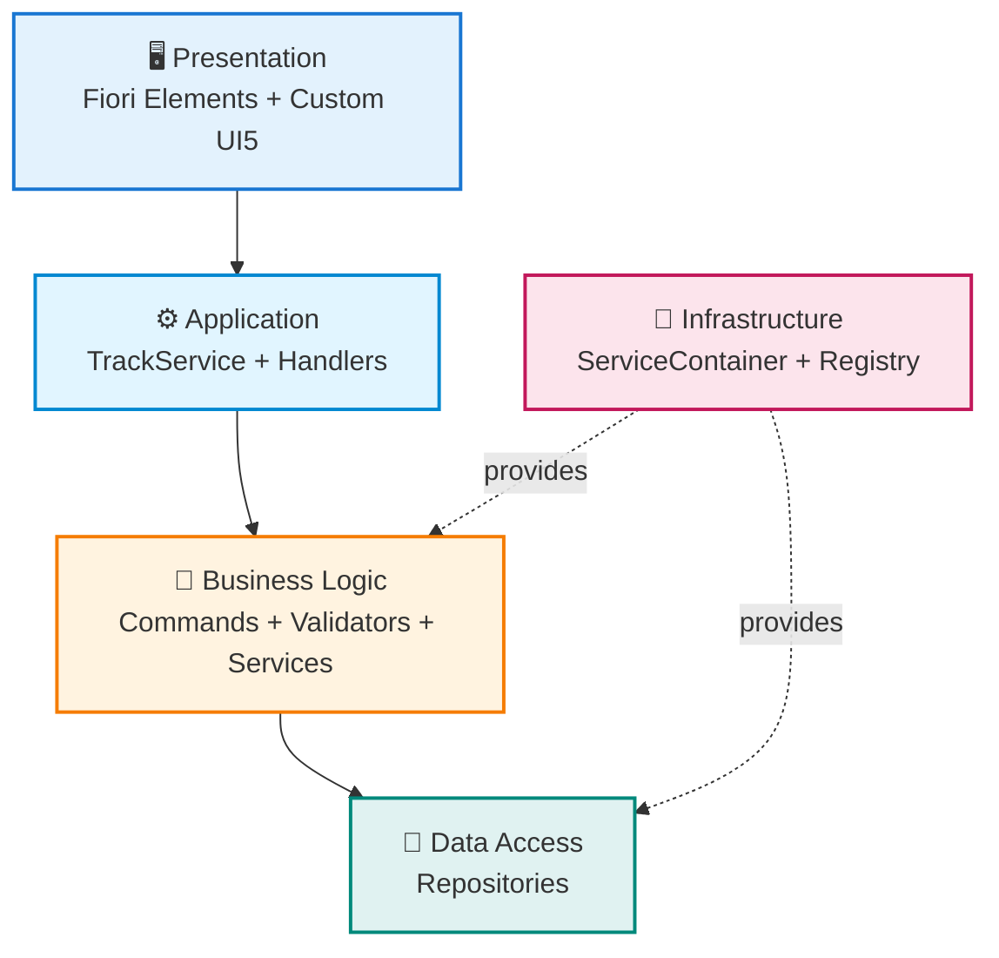
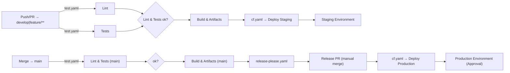

> **An Enterprise-Grade Time Tracking Application with SAP CAP, TypeScript, and Fiori UI5 named CAPture Time**</br>
> Showcase for Clean Architecture, Design Patterns, and Best Practices – documented by developers for developers! 🚀


[](https://www.typescriptlang.org/)
[](https://cap.cloud.sap)
[](https://ui5.sap.com)


[](https://github.com/codespaces/new?hide_repo_select=true&ref=main&repo=nimble-123/cap-fiori-timetracking)

---

## ✨ Highlights

- 🎯 **100% TypeScript** - Type-safe backend without a single JavaScript file
- 🏗️ **Clean Architecture** - 5-tier architecture with 10 design patterns (Command, Repository, Factory, Strategy, ...)
- 🎨 **Multi-App UI Strategy** - Fiori Elements Timetable, Custom Dashboard & Manage Activity Types Maintenance App
- 🧭 **SAP CAP Console** - Native desktop app for local dev, BTP deployment & monitoring from one interface
- 🔧 **Production-Ready** - Validation, error handling, structured logging + Application Logging Service, malware scanning
- 🔐 **IAS & AMS Ready** - `xs-security.json`, AMS policies & DCL deployments for Work Zone / AFS on SAP BTP
- ☁️ **Cloud-native Deployment** - `mta.yaml` for SAP BTP (HANA, Attachments, Logging) + 12-factor compliant packaging
- 📚 **Fully documented** - arc42 architecture, ADRs, inline JSDoc
- 🧪 **Testable** - Jest tests + REST client for manual tests
- 📘 **API Discovery** - Swagger UI preview for TrackService during development

### Screenshot

_Short GIF showing List Report and Object Page while a TimeEntry is updated live._


---

## 🚀 Quick Start

### Option 1: GitHub Codespaces (Fastest Start - 1 Click!)

[](https://github.com/codespaces/new?hide_repo_select=true&ref=main&repo=nimble-123/cap-fiori-timetracking)

1. Click the badge above
2. Wait ~3-5 minutes for setup
3. Run: `npm run watch`
4. Done! 🎉

More details: [.devcontainer/README.md](.devcontainer/README.md) | [ADR-0021](docs/ADR/0021-devcontainer-github-codespaces.md)

### Option 2: Local Installation

```bash
# 1. Clone & Install
git clone https://github.com/nimble-123/cap-fiori-timetracking.git
cd cap-fiori-timetracking
npm install

# 2. Start Development Server
npm run watch
```

**🌐 Browser opens automatically:** `http://localhost:4004`</br>
**🔐 Login:** `max.mustermann@test.de` / Password: `max`</br>
**🧭 Swagger UI (Dev):** `http://localhost:4004/$api-docs/odata/v4/track/`

👉 **Detailed Installation:** See [GETTING_STARTED.md](GETTING_STARTED.md)

---

## 🏗️ Architecture Overview

**5-Tier Clean Architecture** with clear separation of concerns:



**🎯 44 Pattern Classes** organized in 6 categories:

- **Commands** (11) - Business Operations (CRUD, Generation, Balance)
- **Validators** (7) - Domain-specific validation
- **Services** (7) - Domain Logic (TimeCalc, User, Holiday, Balance)
- **Repositories** (7) - Data Access Layer
- **Strategies** (2) - Generation Algorithms (Monthly, Yearly)
- **Factories** (2) - Object Creation (TimeEntry, Handler)

**+ 1 ServiceContainer (DI), 1 HandlerRegistry, 1 HandlerRegistrar, 1 Builder**
**+ 1 DateUtil, 1 Logger, 14 Barrel Exports**

📖 **Deep Dive:** [ARCHITECTURE.md](docs/ARCHITECTURE.md) (complete arc42 documentation)

---

## 🧩 Key Features

- 🕐 **Time Tracking** - CRUD for TimeEntries with automatic calculation (gross/net/overtime/under hours)
- 📅 **Bulk Generation** - Monthly or yearly including holidays (API integration for 16 federal states)
- 💰 **Balance Tracking** - Monthly balances, cumulative total balance, criticality indicators
- 🧰 **Customizing Singleton** - Maintenance of all global defaults (working hours, entry types, thresholds, integration URLs)
- 📎 **Document Attachments** - Upload & download via SAP CAP Attachments Plugin (`@cap-js/attachments`) including Fiori Attachment Facet
- 🔐 **Business Rules** - Validation, uniqueness (1 entry/user/day), change detection
- 🎨 **Multi-App UI** - Timetable & Manage Activity Types (Fiori Elements) plus Custom UI5 Dashboard
- 🏗️ **10 Design Patterns** - Command, Repository, Factory, Strategy, Validator, Handler, Registry, Registrar, Builder, ServiceContainer (DI)

📖 **Details:** [ARCHITECTURE.md](docs/ARCHITECTURE.md) - Complete building block view, runtime view, quality scenarios

---

## 📂 Project Structure

<details>
<summary>Modular 5-tier architecture with clear separation of responsibilities:</summary>

```
cap-fiori-timetracking/
│
├── 📱 app/                                # Frontend Applications (TypeScript UI5)
│   │
│   ├── timetable/                         # Fiori Elements List Report App
│   │   ├── webapp/
│   │   │   ├── Component.ts               # UI5 Component (TypeScript)
│   │   │   ├── manifest.json              # App Descriptor
│   │   │   └── i18n/                      # Internationalization
│   │   └── annotations.cds                # UI Annotations
│   │
│   ├── manage-activity-types/             # Fiori Elements Basic App for master data maintenance
│   │   └── webapp/                        # UI5 Application (TypeScript, Basic V4)
│   │
│   └── timetracking/                      # Custom UI5 Dashboard App
│       ├── webapp/
│       │   ├── controller/                # MVC Controller (TypeScript)
│       │   ├── view/                      # XML Views
│       │   ├── model/                     # Client Models
│       │   └── Component.ts
│       └── annotations.cds
│
├── 💾 db/                                 # Data Model & Master Data
│   │
│   ├── data-model.cds                     # Core Domain Model
│   │   ├── Users, Projects, TimeEntries
│   │   └── ActivityTypes, EntryTypes, Region (CodeLists)
│   └── data/                              # CSV Test & Master Data
│
├── ⚙️ srv/                                # Backend Service Layer (100% TypeScript!)
│   │
│   ├── service-model.cds                  # Top-Level Service Model
│   ├── index.ts                           # Top-Level Barrel Export
│   │
│   └── track-service/                     # TrackService - Complete Service Module
│       │
│       ├── track-service.cds              # OData Service Definition
│       ├── track-service.ts               # 🎬 Orchestrator
│       ├── index.cds                      # Service Entry Point
│       ├── index.ts                       # Service Entry Point
│       │
│       ├── annotations/                   # 📝 UI Annotations
│       │   │
│       │   ├── annotations.cds            # Main Annotations File
│       │   │
│       │   ├── common/                    # Common Annotations
│       │   │   ├── authorization.cds
│       │   │   ├── capabilities.cds
│       │   │   ├── field-controls.cds
│       │   │   ├── labels.cds
│       │   │   └── value-helps.cds
│       │   │
│       │   └── ui/                        # UI-specific per Entity
│       │       ├── activities-ui.cds
│       │       ├── balance-ui.cds
│       │       ├── projects-ui.cds
│       │       ├── timeentries-ui.cds
│       │       ├── users-ui.cds
│       │       └── customizing-ui.cds
│       │
│       └── handler/                       # 🔧 Business Logic & Infrastructure
│           │
│           ├── index.ts                   # Handler Entry Point
│           │
│           ├── container/                 # 🏗️ Dependency Injection
│           │   ├── ServiceContainer.ts    # DI Container
│           │   │   - 6 Categories: Repos, Services, Validators, Strategies, Commands, Factories
│           │   │   - Type-safe Resolution with Generics
│           │   │   - Auto-Wiring of all Dependencies
│           │   └── index.ts               # Barrel Export
│           │
│           ├── registry/                  # 📋 Event Handler Registry
│           │   ├── HandlerRegistry.ts     # Handler Registration
│           │   │   - Supports: before, on, after
│           │   │   - Fluent API & Logging
│           │   ├── HandlerRegistrar.ts    # Handler Registration
│           │   └── index.ts               # Barrel Export
│           │
│           ├── setup/                     # 🏗️ Setup & Initialization
│           │   ├── HandlerSetup.ts        # Builder Pattern for Handler Setup
│           │   └── index.ts               # Barrel Export
│           │
│           ├── handlers/                  # 🎯 Event Handler (Separation of Concerns)
│           │   ├── TimeEntryHandlers.ts   # CRUD
│           │   ├── GenerationHandlers.ts  # Bulk Generation
│           │   ├── BalanceHandlers.ts     # Balance Queries
│           │   └── index.ts               # Barrel Export
│           │
│           ├── commands/                  # 🎯 Command Pattern
│           │   ├── balance/               # Balance Commands
│           │   │   ├── GetMonthlyBalanceCommand.ts
│           │   │   ├── GetCurrentBalanceCommand.ts
│           │   │   ├── GetRecentBalancesCommand.ts
│           │   │   ├── GetVacationBalanceCommand.ts
│           │   │   └── GetSickLeaveBalanceCommand.ts
│           │   ├── generation/            # Generation Commands
│           │   │   ├── GenerateMonthlyCommand.ts
│           │   │   ├── GenerateYearlyCommand.ts
│           │   │   └── GetDefaultParamsCommand.ts
│           │   ├── time-entry/            # TimeEntry Commands
│           │   │   ├── CreateTimeEntryCommand.ts
│           │   │   ├── UpdateTimeEntryCommand.ts
│           │   │   └── RecalculateTimeEntryCommand.ts
│           │   └── index.ts               # Barrel Export
│           │
│           ├── services/                  # 💼 Domain Services
│           ├── repositories/              # 💾 Data Access Layer
│           ├── validators/                # ✅ Business Validation
│           ├── strategies/                # 📋 Generation Algorithms
│           ├── factories/                 # 🏭 Object Creation
│           └── utils/                     # 🛠️ Utilities (DateUtils, Logger)
│
├── mta.yaml                               # ☁️ Multi-Target Application Descriptor (SAP BTP)
├── @cds-models/                           # 🎯 Auto-generated TypeScript Types
├── docs/                                  # 📚 Documentation
│   ├── ARCHITECTURE.md                    # arc42 Architecture
│   └── ADR/                               # Architecture Decision Records
├── test/                                  # 🧪 Tests
└── package.json, tsconfig.json, etc.
```

</details>
</br>

**📖 Detailed Structure & Diagrams:** See [ARCHITECTURE.md - Chapter 5](docs/ARCHITECTURE.md#5-building-block-view)

---

## 📚 Documentation

### 📖 For Beginners

| Document                                     | Content                                     | When to read?         |
| -------------------------------------------- | ------------------------------------------- | --------------------- |
| **[GETTING_STARTED.md](GETTING_STARTED.md)** | Installation, Quick Start, Troubleshooting  | ⭐ **Start here!**    |
| **[README.md](README.md)** (this file)       | Executive Summary, Highlights, Navigation   | Get an overview       |

### 🏗️ For Architects & Developers

| Document                                    | Content                                     | When to read?                            |
| ------------------------------------------- | ------------------------------------------- | ----------------------------------------- |
| **[ARCHITECTURE.md](docs/ARCHITECTURE.md)** | arc42 Documentation (12 Chapters)           | Deep Dive into Architecture              |
| **[ADR Directory](docs/ADR/)**              | 12 Architecture Decision Records            | Why were decisions made?                 |
| **[CONTRIBUTING.md](CONTRIBUTING.md)**      | Code Style, Commit Conventions, PR Process  | Before contributing code                 |

### 🤖 AI Support & Prompts

- **Prompt Catalog:** `.github/prompts/` – YAML prompts according to [GitHub Models Guideline](https://docs.github.com/en/github-models/use-github-models/storing-prompts-in-github-repositories).
- **Role-specific Entry Points:**
  - Product Owner: `product-owner-feature-brief`, `product-owner-story-outline`
  - Reviewer & QA: `review-coach`, `test-strategy-designer`
  - Architecture & Knowledge Building: `architecture-deep-dive`, `adr-drafting-assistant`
  - Operations & Support: `bug-triage-investigator`, `release-notes-curator`
- **MCP Server:** Preconfigured in `.vscode/mcp.json` – `sap-docs` (aggregated SAP Docs via HTTP), `cds-mcp` (CAP Docs), `@sap-ux/fiori-mcp-server` (Fiori UX Guidance), `@ui5/mcp-server` (UI5 SDK). Install `cds-mcp` globally (`npm install -g @cap-js/mcp-server`), the others start automatically or via `npx`.
- **Workflow Tips:** See [GETTING_STARTED.md](GETTING_STARTED.md#-ai-prompts--llm-workflows) for examples of how the prompts are used in Discovery, Delivery, and Review.

### 🎯 arc42 Chapter Quick Access

| Chapter     | Content                                              | Link                                                               |
| ----------- | ---------------------------------------------------- | ------------------------------------------------------------------ |
| **Chap. 1** | Requirements, Quality Goals, Stakeholders            | [Introduction](docs/ARCHITECTURE.md#1-introduction-and-goals)      |
| **Chap. 2** | Technical Constraints, Conventions                   | [Constraints](docs/ARCHITECTURE.md#2-constraints)                  |
| **Chap. 3** | Business/Technical Context (C4 Diagrams)             | [Context](docs/ARCHITECTURE.md#3-context-delimitation)             |
| **Chap. 4** | Solution Strategy, Architecture Drivers              | [Solution Strategy](docs/ARCHITECTURE.md#4-solution-strategy)      |
| **Chap. 5** | Building Block View (5 Levels, 10 Patterns)          | [Building Block View](docs/ARCHITECTURE.md#5-building-block-view)  |
| **Chap. 6** | Runtime View (Sequence Diagrams)                     | [Runtime View](docs/ARCHITECTURE.md#6-runtime-view)                |
| **Chap. 7** | Deployment View (Dev/Cloud/Docker)                   | [Deployment](docs/ARCHITECTURE.md#7-deployment-view)               |
| **Chap. 8** | Cross-cutting Concepts (DI, Validation, Logging)     | [Cross-sections](docs/ARCHITECTURE.md#8-cross-cutting-concepts)    |
| **Chap. 9** | Decisions (ADR Overview)                             | [Decisions](docs/ARCHITECTURE.md#9-architecture-decisions)         |
| **Chap. 10**| Quality Scenarios with Metrics                        | [Quality](docs/ARCHITECTURE.md#10-quality-requirements)            |
| **Chap. 11**| Risks & Technical Debt                                | [Risks](docs/ARCHITECTURE.md#11-risks-and-technical-debt)          |
| **Chap. 12**| Glossary (40+ Terms)                                  | [Glossary](docs/ARCHITECTURE.md#12-glossary)                       |

---

## 🛠️ Development Scripts

| Command                         | Purpose                                             | When to use?                         |
| ------------------------------- | --------------------------------------------------- | ------------------------------------ |
| `npm run watch`                 | Dev server with auto-reload                         | ⭐ **Main command for development**  |
| `npm run build`                 | Compile TypeScript                                  | Before commit (checks syntax)        |
| `npm run format`                | Prettier formatting                                 | **Before every commit (mandatory!)** |
| `npm run generate-entry-point`  | Service entry points for dev tools (dev-cap-tools)  | After new services/commands (optional) |
| `npm test`                      | Run Jest tests                                      | After code changes                   |

📖 **Complete Workflow:** See [GETTING_STARTED.md](GETTING_STARTED.md#-important-npm-scripts)

---

## 🧭 SAP CAP Console

- **Installation:** Download the native desktop app (Windows/macOS) from [SAP Tools](https://tools.hana.ondemand.com/#cloud-capconsole).
- **Project Detection:** The console scans running CAP projects (JavaScript & Java) and lists them automatically; projects can be "remembered" or manually added via "Add Project".
- **Monitoring & Insights:** Visualizes modules from the `mta.yaml`, shows status/CPU/RAM, live logs and offers log level switching, provided the project contains the CAP Console plugin (`@cap-js/console`) – already installed in our case.
- **Deployments:** Guided dialog for SAP BTP Cloud Foundry (check entitlements, create services, in-app or CLI deploy). Standard connections can be stored.
- **Environments & Security:** Environment profiles (.cds/*.yaml, see `.cds/trial.yaml.example`) enable quick switching between local, dev, and prod; SSH tunnels for plugin access can be controlled per app – note security hints.
- **Limitations:** Currently no support for µ-services, MTX, or Kyma; focus on CAP on BTP Cloud Foundry.

The console complements our local tools (REST Client, Swagger UI) and is recommended for onboarding sessions for troubleshooting and first deployments.

---

## 🔁 Inner Loop Development

1. **Watch & Hot Reload**
   `npm run watch` is based on `cds watch`/`cds-tsx` and uses CAP's development profile with local mock services (SQLite, Mock Auth). This keeps the loop fast even offline ("airplane mode").
2. **CAP Console & REST Client**
   The CAP Console (see above) provides monitoring, deploy wizard, and log level switching. REST client files in `tests/` and Swagger UI (`/$api-docs/…`) complement manual checks.
3. **Type Safety & Linting**
   `@cap-js/cds-typer` updates types automatically on `.cds` changes. `npm run build` + ESLint/Prettier (`npx eslint …`, `npx prettier --check …`) ensure style & rules. `npm run generate-entry-point` provides updated entry points if needed for tooling.
4. **Tests & Coverage**
   `npm test` or `npm run test:watch` covers Jest suites; coverage is under `coverage/`. New business logic → new tests in `tests/`.
5. **Optional Rapid UI Feedback**
   UI5 tooling (`npm run watch -- --open`) or live logs in the CAP Console support quick UI tuning before going into the outer loop (PR/CI).

> Goal: Keep the loop "Change → Observe → Validate" in a few minutes before features go into the outer loop (PR, CI, deployment).

---

## ⚙️ Automation & DevOps

- **CI/CD Tests & Build** (`.github/workflows/test.yaml`): Runs on push/PR for `develop`, `main`, and `feature/**`; lint & unit tests are run separately (fail-fast). Only when both jobs succeed does the build job (`cds-typer`, `npm run build`) create artifacts (`gen/`, `@cds-models/`) and coverage/JUnit reports.
- **Release Automation** (`.github/workflows/release-please.yaml`): Reacts via `workflow_run` to successful `main` builds. It updates/creates the release PR, but only sets tags and GitHub releases after merging this PR (see [ADR-0017](docs/ADR/0017-release-automation-with-release-please.md)).
- **Cloud Foundry Deploy** (`.github/workflows/cf.yaml` + Composite Action `cf-setup`): Automatic staging rollout after successful `develop` build, production deployment after successful release automation (or via dispatch). Both jobs depend on GitHub environments (`Staging`, `Production`) – production waits for manual approval from reviewers and uses the same cf/mbt toolchains as local.



> Local prerequisite for deployments: `cf` CLI ≥8 with MultiApps plugin (`cf install-plugin multiapps`) and `mbt` CLI (`npm install -g mbt`). The GitHub action installs these tools automatically, locally they must be set up manually.

---

## 🌐 CAP Plugins & Calesi Pattern

- **Calesi ("CAP-level Service Integrations")** stands for the steadily growing CAP plugin ecosystem (GraphQL, OData V2, WebSockets, OpenTelemetry, Attachments, Messaging, Notifications, Audit Logging, …).
- Through CAP's open architecture, we use plugins like `@cap-js/attachments` or `@cap-js/console` without vendor lock-in and extend the system modularly.
- Own extensions follow the same pattern (`cds add …`, register in ServiceContainer) and can be shared as reuse packages if needed.
- See [CAP Plugins](https://cap.cloud.sap/docs/plugins/) and [ADR-0018](docs/ADR/0018-mta-deployment-cloud-foundry.md) for dealing with infrastructure add-ons.

---

## ☁️ Cloud Deployment (SAP BTP)

- `mta.yaml` bundles CAP service (`gen/srv`), HANA DB deployer (`gen/db`), the UI content module (`cap-fiori-timetracking-app-deployer`), the AMS policy deployer (`cap-fiori-timetracking-ams-policies-deployer`), and binds attachments, malware scanning, connectivity, destination, application logging, identity, and the application frontend service for hosting the Fiori apps.
- Before deploying, create the required instances (once per subaccount):

  ```bash
  cf create-service hana hdi-shared cap-fiori-timetracking-db
  cf create-service objectstore standard cap-fiori-timetracking-attachments
  cf create-service malwarescanning standard cap-fiori-timetracking-malware-scanner
  cf create-service application-logs standard cap-fiori-timetracking-logging
  cf create-service connectivity lite cap-fiori-timetracking-connectivity
  cf create-service destination lite cap-fiori-timetracking-destination
  cf create-service app-front developer cap-fiori-timetracking-app-front
  cf create-service identity application cap-fiori-timetracking-ias
  cf create-service identity-authorization application cap-fiori-timetracking-ams
  ```

- The Application Frontend Service provides a managed app router including static hosting for the Fiori apps; the destinations from `cap-fiori-timetracking-app-deployer` are automatically stored there.
- IAS (Identity Authentication Service) provides productive authentication; AMS (Authorization Management Service) hosts the policies from `ams/dcl`. The deployer uploads the DCL files per task to the AMS.
- Build & Deploy via Cloud MTA Build Tool (requires `cf` CLI + MultiApps plugin, `mbt` CLI, and JDK ≥17 for the `@sap/ams-dev` build plugin – locally e.g. Temurin 17):

  ```bash
  npm ci
  npm run clean        # optional, removes old artifacts
  npm run build:mta
  npm run deploy:cf
  ```

- The build generates deterministic `gen/mta.mtar`. This artifact is used by both the CF deployment pipeline and the release asset.
- The CAP runtime binding to `application-logging`, `malware-scanner`, `connectivity`, and `destination` is stored in `package.json → cds.requires`; local development uses mock auth, in BTP the service bindings apply automatically. `connectivity` + `destination` provide the 3rd-party holiday API via destination. The build/run split fulfills central 12-factor principles and qualifies the solution as a cloud-native application.

---

## 🤝 Contributing

Want to contribute to the project? **Awesome!** 🎉

### Quick Guide

1. **Fork & Clone** the repository
2. **Create branch**: `git checkout develop && git checkout -b feature/my-feature`
3. **Write code** (see [CONTRIBUTING.md](CONTRIBUTING.md) for style guidelines)
4. **Tests + Format**: `npm test && npm run format`
5. **Commit**: `git commit -m "feat: add awesome feature"` ([Conventional Commits](https://www.conventionalcommits.org/))
6. **Push & PR**: `git push origin feature/my-feature` → Pull Request against `develop`

### Important Rules

- ✅ TypeScript without `any` types
- ✅ Follow design patterns (Command, Repository, Factory, ...)
- ✅ JSDoc for all public APIs
- ✅ Prettier before commit (`npm run format`)
- ✅ Conventional Commits (`feat:`, `fix:`, `docs:`, ...)

📖 **Complete Guidelines:** See [CONTRIBUTING.md](CONTRIBUTING.md)

---

## 📦 Release Process

- Automated release PRs are created via [release-please](https://github.com/googleapis/release-please-action) based on our conventional commits.
- The configuration (`release-please-config.json`, `.release-please-manifest.json`) keeps root and UI5 app versions (`app/timetable`, `app/timetracking`, `app/manage-activity-types`) as well as `mta.yaml` synchronized via `extra-files`.
- As long as the release PR is open, the release remains unpublished. Only the merge to `main` creates tag & changelog; npm publication is not planned.
- As soon as release-please creates a new release, the workflow attaches the CI-generated `gen/mta.mtar` as `cap-fiori-timetracking_<version>.mtar` to the GitHub release assets.
- Before the first run in CI, a local dry-run is recommended:
  ```bash
  npx release-please release-pr --config-file release-please-config.json --manifest-file .release-please-manifest.json --dry-run
  ```
- Visual flow (simplified):
  ```mermaid
  gitGraph
    commit id: "main"
    branch develop
    checkout develop
    commit id: "feat: holiday API cache"
    commit id: "test: cover holiday cache"
    branch feature/holiday-sync
    checkout feature/holiday-sync
    commit id: "feat: adjust UI"
    checkout develop
    merge feature/holiday-sync
    commit id: "refactor: cleanup"
    checkout main
    merge develop
    branch release-please/main
    checkout release-please/main
    commit id: "chore: release v1.1.0"
    checkout main
    merge release-please/main tag: "v1.1.0"
    commit id: "ci: deploy production"
  ```

---

## 📊 Project Stats

**45 Pattern Classes + 14 Barrel Exports:**

- 11 Commands (CRUD, Generation, Balance)
- 7 Validators (Domain-specific)
- 7 Repositories (Data Access)
- 7 Services (Domain Logic + Customizing)
- 2 Strategies (Algorithms)
- 2 Factories (TimeEntry + Handler)
- 1 ServiceContainer (DI with 6 categories)
- 1 HandlerRegistry (Event-Driven)
- 1 HandlerRegistrar
- 1 HandlerSetup (Builder with Fluent API)
- 3 Handler Classes
- 1 Logger
- 1 DateUtils

---

## 🌐 Links & Resources

### Internal Documentation

- 📖 [ARCHITECTURE.md](docs/ARCHITECTURE.md) - Complete arc42 documentation
- 🚀 [GETTING_STARTED.md](GETTING_STARTED.md) - Installation & Quick Start
- 🤝 [CONTRIBUTING.md](CONTRIBUTING.md) - Contribution Guidelines
- 📋 [ADR Directory](docs/ADR/) - Architecture Decision Records

### External Resources

- **SAP CAP**: [cap.cloud.sap](https://cap.cloud.sap) - Official CAP Documentation
- **SAPUI5**: [ui5.sap.com](https://ui5.sap.com) - UI5 SDK & Samples
- **TypeScript**: [typescriptlang.org](https://www.typescriptlang.org) - TypeScript Handbook
- **Fiori Guidelines**: [experience.sap.com/fiori-design](https://experience.sap.com/fiori-design) - Design Principles
- **Holiday API**: [feiertage-api.de](https://feiertage-api.de) - German Public Holidays

---

## 📜 License

[**MIT License**](./LICENSE) - Do whatever you want with this code! 🚀

---

## 🙏 Acknowledgments

- **SAP CAP Team** - For the great framework
- **UI5 Team** - For Fiori Elements & UI5
- **TypeScript Team** - For type-safe development
- **Open Source Community** - For inspiration & best practices

---

**Happy Coding!** 🚀

_Built with ❤️ and TypeScript in 2025_

```

```
