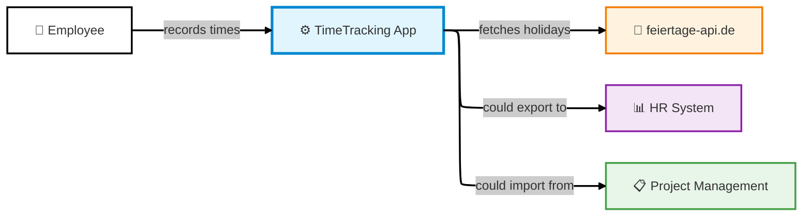
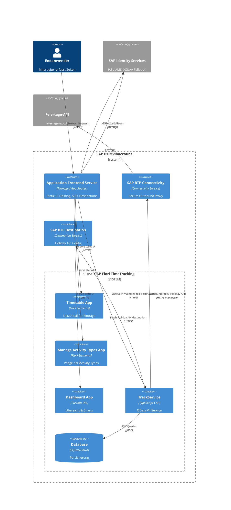
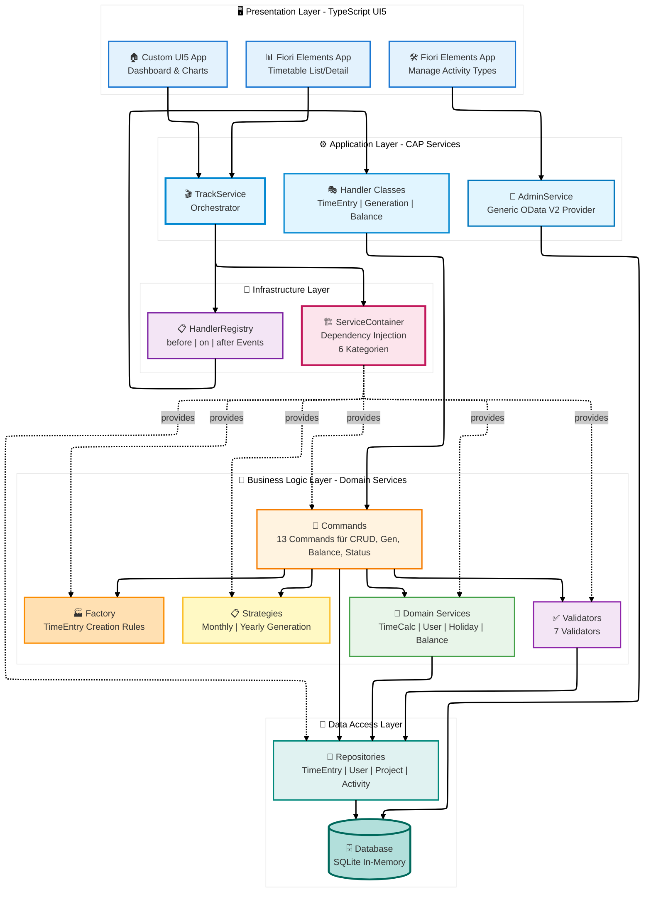
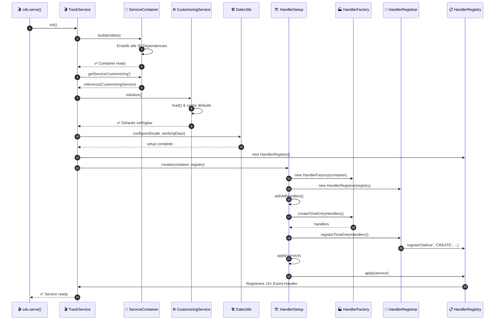
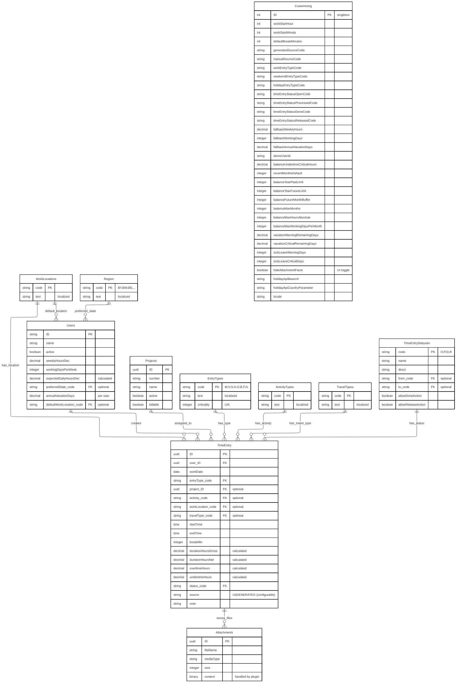
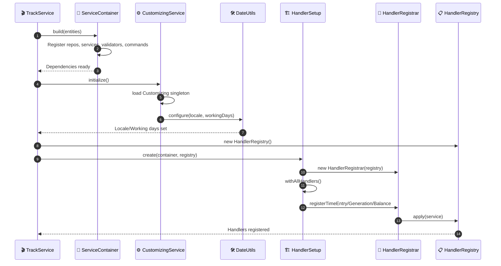
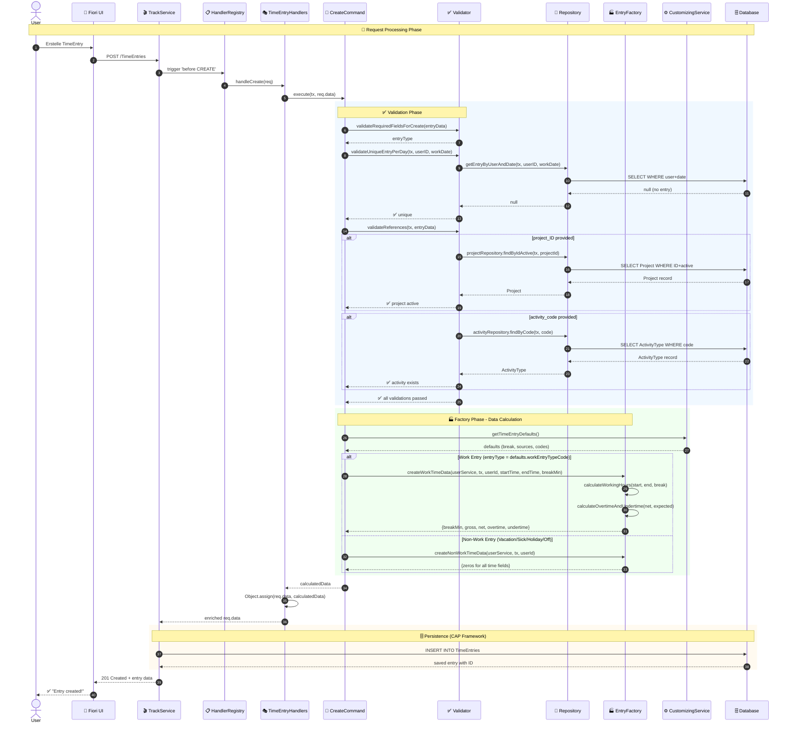
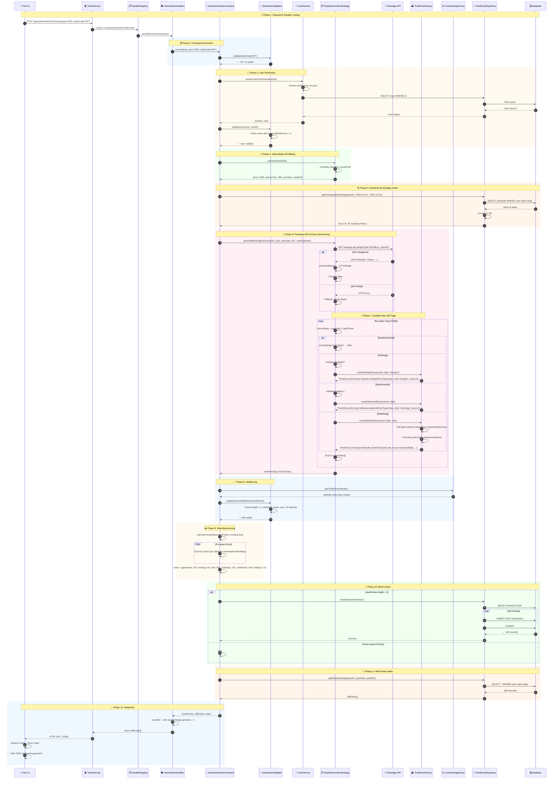
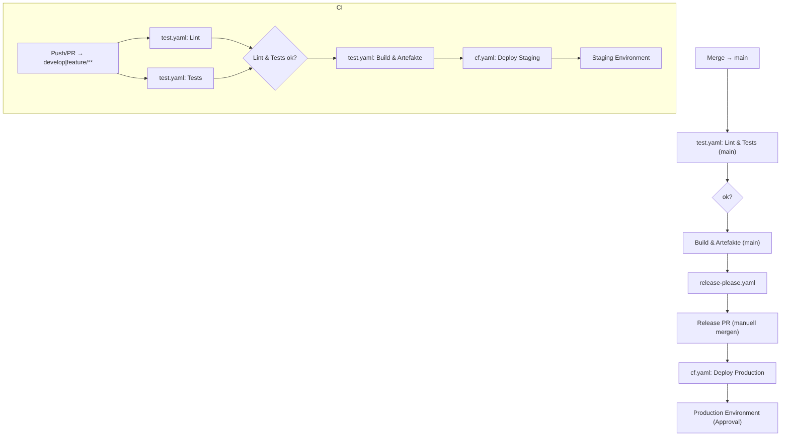
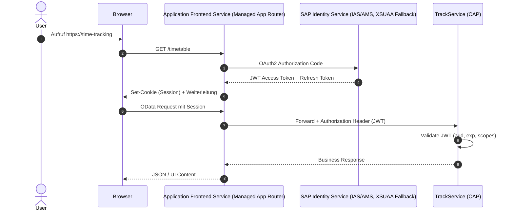

# 🏗️ CAPture Time - Architecture Documentation (arc42)

Time tracking application based on SAP Cloud Application Programming Model with TypeScript backend and Fiori UI5 frontend. Documented according to arc42 template.

---

## 📑 Table of Contents

### [1. Introduction and Goals](#1-introduction-and-goals-1)

- [1.1 Problem Statement](#11-problem-statement)
- [1.2 Quality Goals](#12-quality-goals)
- [1.3 Stakeholders](#13-stakeholders)

### [2. Constraints](#2-constraints-1)

- [2.1 Technical Constraints](#21-technical-constraints)
- [2.2 Organizational Constraints](#22-organizational-constraints)
- [2.3 Conventions](#23-conventions)

### [3. System Scope and Context](#3-system-scope-and-context-1)

- [3.1 Business Context](#31-business-context)
- [3.2 Technical Context](#32-technical-context)

### [4. Solution Strategy](#4-solution-strategy-1)

- [4.1 Central Architecture Approaches](#41-central-architecture-approaches)
- [4.2 Key Design Decisions](#42-key-design-decisions)
- [4.3 Quality Assurance](#43-quality-assurance)
- [4.4 Inner Loop Development & Airplane Mode](#44-inner-loop-development--airplane-mode)

### [5. Building Block View](#5-building-block-view-1)

- [5.1 Level 1: Overall System (Whitebox)](#51-level-1-overall-system-whitebox)
- [5.2 Level 2: Application Layer (Whitebox TrackService)](#52-level-2-application-layer-whitebox-trackservice)
- [5.2a Application Layer: AdminService (Generic Provider)](#52a-application-layer-adminservice-generic-provider)
- [5.3 Level 3: Business Logic Layer (Whitebox Commands)](#53-level-3-business-logic-layer-whitebox-commands)
- [5.4 Level 4: Data Model (Domain Model)](#54-level-4-data-model-domain-model)
- [5.5 Level 5: Infrastructure Layer (ServiceContainer & HandlerRegistry)](#55-level-5-infrastructure-layer-servicecontainer--handlerregistry)
- [5.6 Level 6: User Interface Layer (Fiori Elements & Freestyle Apps)](#56-level-6-user-interface-layer-fiori-elements--freestyle-apps)

### [6. Runtime View](#6-runtime-view-1)

- [6.1 Scenario 1: Create TimeEntry (CREATE)](#61-scenario-1-create-timeentry-create)
- [6.2 Scenario 2: Yearly Generation (Yearly Generation)](#62-scenario-2-yearly-generation-yearly-generation)

### [7. Deployment View](#7-deployment-view-1)

- [7.1 Infrastructure Level 1: Development Environment](#71-infrastructure-level-1-development-environment)
- [7.2 Infrastructure Level 2: Production Environment (SAP BTP)](#72-infrastructure-level-2-production-environment-sap-btp)
- [7.3 Deployment Scenarios](#73-deployment-scenarios)
- [7.4 Secret Management & Transport](#74-secret-management--transport)
- [7.5 CI/CD Workflow Overview](#75-cicd-workflow-overview)

### [8. Cross-Cutting Concepts](#8-cross-cutting-concepts-1)

- [8.1 Dependency Injection (ServiceContainer Pattern)](#81-dependency-injection-servicecontainer-pattern)
- [8.2 Validation (7 Validators)](#82-validation-7-validators)
- [8.3 Time Calculations](#83-time-calculations)
- [8.4 Error Handling & Logging](#84-error-handling--logging)
- [8.5 Internationalization (i18n)](#85-internationalization-i18n)
- [8.6 Caching](#86-caching)
- [8.7 Performance Optimizations](#87-performance-optimizations)
- [8.8 Document Attachments (Attachments Plugin)](#88-document-attachments-attachments-plugin)
- [8.9 OpenAPI & Swagger UI](#89-openapi--swagger-ui)
- [8.10 Security & Compliance](#810-security--compliance)
- [8.11 AI Assistance & Prompt Catalog](#811-ai-assistance--prompt-catalog)
- [8.12 Developer Experience: SAP CAP Console](#812-developer-experience-sap-cap-console)
- [8.13 CAP Plugins & Calesi Pattern](#813-cap-plugins--calesi-pattern)

### [9. Architecture Decisions](#9-architecture-decisions-1)

### [10. Quality Requirements](#10-quality-requirements-1)

- [10.1 Test Strategy & Coverage](#101-test-strategy--coverage)
- [10.2 Quality Tree](#102-quality-tree)
- [10.3 Quality Scenarios](#103-quality-scenarios)
- [10.4 Quality Attributes: Trade-Offs](#104-quality-attributes-trade-offs)

### [11. Risks and Technical Debt](#11-risks-and-technical-debt-1)

- [11.1 Risks](#111-risks)
- [11.2 Technical Debt](#112-technical-debt)
- [11.3 Known Issues](#113-known-issues)

### [12. Glossary](#12-glossary-1)

---

## 🔗 Navigation

- **← Back:** [README](../README.md) - Executive Summary
- **→ Next:** [GETTING_STARTED](../GETTING_STARTED.md) - Installation & Quick Start
- **📚 More:** [CONTRIBUTING](../CONTRIBUTING.md) - Contribution Guidelines
- **📋 ADRs:** [ADR Directory](ADR/) - Architecture Decision Records

---

## 1. Introduction and Goals

### 1.1 Problem Statement

**Business Problem:**

Employees in companies must document their working hours for:

- Project billing and controlling
- Human Resources (vacation, sick leave, overtime)
- Legal working time documentation

**Business Requirements:**

| Category              | Requirements                                                     |
| -------------------- | ----------------------------------------------------------------- |
| **Time Entry**        | Recording of start/end time, breaks, project assignment           |
| **Calculations**      | Automatic calculation of gross/net time, over/under hours         |
| **Bulk Operations**   | Monthly or yearly pre-generation of work days                     |
| **Balance Management** | Time account tracking over months                                |
| **Absences**         | Vacation, sick leave, public holidays (state-dependent)          |
| **Project Controlling** | Booking on projects and activity types                           |

**Target Users:**

- Employees (daily)
- Project managers (weekly for evaluations)
- Human Resources (monthly)
- Developers (as reference implementation)

---

### 1.2 Quality Goals

Top 5 quality goals by priority:

| Priority | Quality Goal    | Concrete Metric                                | Rationale                               |
| -------- | --------------- | ---------------------------------------------- | --------------------------------------- |
| 1        | **Maintainability** | New features in max. 2 working days        | Frequent change requests from business  |
| 2        | **Testability**     | All business logic classes isolatedly testable | High code quality without regression risk |
| 3        | **Performance**     | Yearly generation < 2 seconds              | User acceptance for bulk operations     |
| 4        | **Type Safety**     | 100% TypeScript, no any-types              | Errors at compile-time not runtime      |
| 5        | **Usability**       | New entry in < 30 seconds                  | Daily usage must be fast                |

**Quality Scenarios (Examples):**

- **QS-1 (Maintainability):** A developer can add a new balance calculation (e.g., for flexible hours) in 2 days by creating a new command and service.
- **QS-2 (Testability):** All 13 commands can be tested in isolation with mock dependencies without CAP server.
- **QS-3 (Performance):** Generation of 365 days including holiday API call takes max. 2 seconds.

---

### 1.3 Stakeholders

| Role                    | Contact            | Expectation                                    | Relevance   |
| ----------------------- | ------------------ | ---------------------------------------------- | ----------- |
| **Developers**          | Development Team   | Clean architecture, good docs, TypeScript      | ⭐⭐⭐ High   |
| **Employees**           | End Users          | Fast, simple time entry                        | ⭐⭐⭐ High   |
| **Project Managers**    | Management         | Project time evaluations                       | ⭐⭐ Medium  |
| **Human Resources**     | HR Department      | Vacation days, sick days                       | ⭐⭐ Medium  |
| **Software Architects**  | Architecture Board | Reference implementation for CAP+TypeScript    | ⭐⭐ Medium  |
| **Operations**          | IT Operations      | Simple deployment, monitoring                  | ⭐ Low     |

---

## 2. Constraints

### 2.1 Technical Constraints

| Constraint                                          | Description                                          | Impact                                                        |
| --------------------------------------------------- | ---------------------------------------------------- | ------------------------------------------------------------- |
| **SAP CAP Framework**                               | Cloud Application Programming Model (Node.js-based) | Architecture must use CAP events                              |
| **TypeScript >= 5.0**                               | Fully typed codebase                                 | Strict type checks enabled                                    |
| **UI5 >= 1.120**                                    | SAP UI5 for frontend applications                   | Follow Fiori Guidelines                                       |
| **Node.js >= 22 LTS**                               | Runtime environment                                 | ES2022 features available                                     |
| **OData V4**                                        | REST protocol for UI-backend communication           | Complex queries via $expand/$filter                           |
| **@cap-js/attachments**                             | Official CAP Attachments Plugin for file storage    | Standardized upload/download flows, metadata & persistence    |
| **SAP Identity Services** (IAS / AMS, XSUAA Fallback) | Authorization & authentication on BTP              | JWT-based SSO tokens, Role Collections, Policy Management     |
| **Cloud-native Principles**                         | 12-Factor-compliant app design on SAP BTP           | Configuration decoupling, declarative deployments (MTA)       |
| **SQLite (Dev) / HANA (Prod)**                      | Database technologies                               | SQL must be compatible                                        |

**Development Tools:**

- **VS Code** as primary IDE
- **ESLint + Prettier** for code quality (mandatory)
- **Jest** for unit tests
- **Git** for version control
- **nvm + .nvmrc** to pin Node versions (22.20.0)
- **.env/.env.example** for local secrets & feature toggles (never commit to repo)

---

### 2.2 Organizational Constraints

| Constraint           | Description                                                                                    |
| -------------------- | ---------------------------------------------------------------------------------------------- |
| **Team**             | 1-3 developers (Fullstack CAP/UI5)                                                             |
| **Methodology**      | Agile development, 2-week sprints                                                              |
| **Code Reviews**     | Mandatory for all pull requests                                                                |
| **Documentation**    | ADRs (Architecture Decision Records) for all major decisions                                   |
| **Deployment**       | CI/CD-ready, automated builds                                                                  |
| **Security Governance** | Role model & policy management via BTP Role Collections, release process for prod roles     |

---

### 2.3 Conventions

**Code Conventions:**

- **Language:** English for code, German for docs
- **Naming:** camelCase (variables), PascalCase (classes), kebab-case (files)
- **Commits:** Conventional Commits (`feat:`, `fix:`, `docs:`)
- **File Structure:** Barrel Exports (`index.ts`) for each directory
- **JSDoc:** Mandatory for all public APIs

**Architecture Conventions:**

- Dependency Injection via ServiceContainer (no direct `new` calls)
- Business logic only in Commands
- Data access only via Repositories
- Handlers are "thin orchestrators"
- Secrets/configuration exclusively via environment variables (CAP `.env`, BTP service bindings); never hard-code in source or CSV

---

## 3. System Scope and Context

### 3.1 Business Context

**External Communication Partners:**



**Status Model & Workflow:**

- `TimeEntryStatuses` represents the editable status lifecycle (`O`pen, `P`rocessed, `D`one, `R`eleased) including allowed transitions (`from_code` / `to_code`) and UI permissions (`allowDoneAction`, `allowReleaseAction`).
- `TimeEntries.status_code` associates each entry with exactly one status. Changes to an entry automatically enforce the `Processed` status; final release (`Released`) only occurs via dedicated actions.
- The `Customizing` singleton provides all status codes as configuration, allowing tenants to maintain their own codes without modifying business logic.
- Bound status actions `markTimeEntryDone` and `releaseTimeEntry` set individual entries via OData to the configured target status and enforce master data transitions as well as locks for finally released entries.

**Interface Description:**

| Partner                          | Input                       | Output                         | Protocol / Intermediary                    |
| -------------------------------- | --------------------------- | ------------------------------ | ------------------------------------------ |
| **Employee**                     | Time entries, Balance query | Calculated times, Balance data | UI5 Frontend                               |
| **feiertage-api.de**             | Year, State code            | JSON with holidays             | SAP BTP Connectivity + Destination → REST  |
| **HR System** (future)           | -                           | CSV/Excel Export               | File                                       |
| **Project Management** (future)  | Project master data         | -                              | REST API                                   |
| **SAP Identity Services**        | OAuth2/SAML Request         | JWT + Role Collections         | HTTPS                                      |

---

#### 🔗 External Integrations: Holiday API

The application integrates the free **[Holiday API (feiertage-api.de)](https://feiertage-api.de)** for automatic recognition of German holidays during yearly generation of time entries.

**Local Development:**

- **Direct HTTP-Call** via `fetch()` without additional setup steps
- Konfiguration über `.env`:
  ```bash
  HOLIDAY_API_BASE_URL=https://feiertage-api.de
  ```

**Production (SAP BTP):**

- **Destination**: `holiday-api` (automatically created via `mta.yaml`)
- **Connectivity Service**: Managed proxy for outbound calls
- **Integration**: Via `@sap-cloud-sdk/connectivity` + `@sap-cloud-sdk/http-client`
- **Security**: No credentials in code – URL is managed in BTP Destination

**Hybrid Architecture:**

Der `HolidayService` wählt automatisch den richtigen Code-Pfad basierend auf der Umgebung:

```typescript
// Environment-Detection
private isProduction(): boolean {
  return process.env.NODE_ENV === 'production' || !!process.env.VCAP_SERVICES;
}

// Local: Direct Fetch
private async fetchDirectly(year: number, stateCode: string) {
  const url = this.buildHolidayUrl(year, stateCode);
  const response = await fetch(url, { signal: AbortSignal.timeout(5000) });
  // ...
}

// BTP: Destination-based
private async fetchViaDestination(year: number, stateCode: string) {
  const destination = { destinationName: 'holiday-api' };
  const response = await executeHttpRequest(destination, {
    method: 'GET',
    url: `/api/?jahr=${year}&nur_land=${stateCode}`,
    timeout: 5000,
  });
  // ...
}
```

**Technical Features:**

- ✅ **Caching Strategy:** Per year + state code (Key: `${year}-${stateCode}`)
- ✅ **Graceful Degradation:** Empty map returned on API errors
- ✅ **Support:** All 16 German states
- ✅ **Logging:** Structured logging for both code paths
- ✅ **Timeout:** 5 seconds for all API calls
- ✅ **Performance:** ~200ms per API call, then cached

**Architecture References:**

- **Implementation:** `srv/track-service/handler/services/HolidayService.ts`
- **MTA Configuration:** `mta.yaml` → `resources.cap-fiori-timetracking-destination`
- **Tests:**
  - `tests/integration/holiday-service.test.ts` - Integration tests with API mocks
  - `tests/unit/holiday-service.test.ts` - Unit tests for caching & error handling
- **ADR:** [ADR-0020: Holiday API Integration via BTP Destination](ADR/0020-holiday-api-btp-destination.md)

**Business Impact:**

- Automatic holiday recognition during yearly generation
- Correct booking of non-working days (EntryType `H` = Holiday)
- Consideration of state-specific holidays (e.g., Epiphany only in BY, BW, ST)
- Significantly reduces manual effort for holiday maintenance

---

### 3.2 Technical Context

**Deployment Overview:**



**Technologie-Mapping:**

| Komponente                       | Technologie            | Port/URL                             | Verantwortlichkeit                                  |
| -------------------------------- | ---------------------- | ------------------------------------ | --------------------------------------------------- |
| **Timetable App**                | UI5 Fiori Elements     | :4004/io.nimble.timetable/           | Annotations-basiertes UI                            |
| **Manage Activity Types**        | UI5 Fiori Elements     | :4004/io.nimble.manageactivitytypes/ | Stammdatenpflege Activity Types (AdminService)      |
| **Dashboard App**                | UI5 Custom             | :4004/io.nimble.timetracking/        | Freies Dashboard-Design                             |
| **TrackService**                 | CAP TypeScript         | :4004/odata/v4/track/                | Time Tracking Domain-Logik                          |
| **AdminService**                 | CAP TypeScript         | :4004/odata/v2/admin/                | Stammdaten & Customizing API                        |
| **Database**                     | SQLite                 | In-Memory                            | Datenhaltung                                        |
| **Feiertage-API**                | REST                   | feiertage-api.de/api/                | Externe Datenquelle                                 |
| **Application Frontend Service** | SAP Managed App Router | Subaccount Route (Managed)           | Authenticated Routing, Static Hosting, Destinations |
| **SAP Identity Services**        | IAS / AMS              | OAuth2 / SAML Endpoint               | Token-Ausgabe, Role Collections                     |
| **Connectivity Service**         | SAP BTP Service        | cf:<space>/connectivity              | Outbound Proxy für Holiday API                      |
| **Destination Service**          | SAP BTP Service        | cf:<space>/destination               | Holiday API Destinations & Credentials              |

> Hinweis: Die HTML5-Apps nutzen den Application Frontend Service mit einer verwalteten Destination (`srv-api`), die über das Content Module ausgeliefert wird. Die Destination- und Connectivity-Services sind ausschließlich für den Outbound-Aufruf der Feiertags-API durch den TrackService angebunden.

**Wichtige Datenformate:**

- **OData V4**: JSON für Entity-Daten
- **CDS Types**: Auto-generiert via @cap-js/cds-typer
- **Feiertage**: JSON `{"Neujahr": {"datum": "2025-01-01", "hinweis": ""}}`
- **JWT Claims**: Transport der BTP-Rollen (`scope`, `roleCollections`) für CAP `@restrict`

**Security-Kontext & Trust Boundaries:**

- **AuthN-Fluss:** User → Application Frontend Service → SAP IAS → Application Frontend Service → CAP. Der Managed App Router initiiert den OAuth2-Code-Flow gegen IAS; via `xsuaa-cross-consumption` akzeptiert CAP weiterhin XSUAA-Tokens (Fallback).
- **AuthZ-Fluss:** IAS-Rollen-Collections liefern Scopes aus `xs-security.json` (TimeTrackingUser/Approver/Admin). AMS Policies (`ams/dcl/basePolicies.dcl`) verteilen Attribute wie `PreferredState`, `ProjectID`, `ProjectNumber` und `StatusCode`, die via `db/ams-attributes.cds` an CAP bereitgestellt und von `@restrict`-Regeln ausgewertet werden.
- **Tenant-Isolation:** Jede Subaccount-Instanz nutzt eigene Service-Bindings (HANA Schema, IAS, AMS), wodurch Daten und Rollen mandantenspezifisch isoliert werden.
- **Entwicklung vs. Produktion:** Lokal mockt CAP den Identity Layer (`cds.requires.[development].auth.kind = mocked`). In BTP ist `cds.requires.auth = "ias"` aktiv; alle Endpunkte verlangen gültige JWTs, die Work Zone/AFS durchreichen.

---

## 4. Solution Strategy

### 4.1 Central Architecture Approaches

**Chosen Strategy: Clean Architecture with Design Patterns**

The application follows a **strict 3-tier architecture** with clear separation:

| Layer            | Technology                     | Responsibility                   |
| ------------------- | ------------------------------- | -------------------------------- |
| **Presentation**   | UI5 (Fiori Elements + Custom)  | User Interface, Rendering        |
| **Application**    | CAP Service (TypeScript)       | Request-Handling, Orchestration  |
| **Business Logic** | Commands, Validators, Services | Business logic, Calculations     |
| **Data Access**    | Repositories                   | SQL-Queries, Database access     |

**Architecture Drivers:**

| Quality Goal       | Chosen Approach           | Implementation                                                        |
| -------------------- | -------------------------- | --------------------------------------------------------------------- |
| **Maintainability**  | Clean Architecture + SOLID | Each class has exactly one responsibility                              |
| **Testability**      | Dependency Injection       | ServiceContainer manages all dependencies                              |
| **Extensibility**    | Design Patterns            | Strategy (Algorithms), Command (Operations)                            |
| **Type Safety**      | TypeScript Strict Mode     | Auto-generated types from CDS models                                   |
| **Performance**      | Repository Pattern         | Batch operations, Caching (HolidayService)                             |
| **Cloud Native**     | 12-Factor + MTA Deployment | External configuration, Build/Run separation, declarative CF deployments |

---

### 4.2 Wichtigste Design-Entscheidungen

**Top-10-Entscheidungen:**

1. **TypeScript instead of JavaScript** → Compile-time validation, better tooling
2. **Design Patterns** → Structured, reusable architecture (13 Commands, 7 Validators, 2 Strategies)
3. **ServiceContainer (DI)** → Central dependency resolution
4. **Command Pattern** → Encapsulates business operations
5. **Repository Pattern** → Abstracts data access
6. **Factory Pattern** → Consistent domain objects
7. **Multi-App UI Strategy** → Two Fiori Elements apps + Custom dashboard (depending on use case)
8. **Modular CDS Annotations** → common/ + ui/ instead of monolith
9. **Customizing Singleton** → Global defaults centrally maintained via CustomizingService
10. **ADR Documentation & Tooling** → Traceable decisions + REST client tests

Details for all decisions: see [Chapter 9 - Architecture Decisions](#9-architecture-decisions)

---

### 4.3 Qualitätssicherung

**Maßnahmen pro Qualitätsziel:**

| Ziel              | Maßnahme                             | Werkzeug                           |
| ----------------- | ------------------------------------ | ---------------------------------- |
| **Wartbarkeit**   | Clean Architecture, SOLID Principles | ESLint Rules, Code Reviews         |
| **Testbarkeit**   | DI, Interface Segregation            | Jest (Unit Tests)                  |
| **Performance**   | Batch Operations, Caching            | Performance-Messung bei Generation |
| **Typsicherheit** | TypeScript Strict Mode               | TSC Compiler                       |
| **Bedienbarkeit** | Fiori Guidelines                     | UX Reviews                         |

---

### 4.4 Inner Loop Development & Airplane Mode

- **Local Mocks:** CAP's development preset (`profile: development`) uses SQLite, mock auth & generic providers → fast loops without cloud connectivity ("airplane mode").
- **`cds watch` & Hot Reload:** `npm run watch` starts CAP, UI5 workspaces (sapux) and TypeScript watcher in parallel. Changes are visible in seconds.
- **Hybrid & Cloud Loops:** When needed, `cds` automatically switches to real services (HANA, IAS/XSUAA, AMS, Connectivity/Destination) as soon as `profile: production` or BTP bindings take effect.
- **Parallelized Teams:** Frontend & backend can work independently; CDS services provide generic REST/OData repositories that are later replaced by custom handlers.
- **Spätes Schneiden (Modulith → Microservices):** Wir folgen dem CAP-Modulith-Ansatz; mehrere Services laufen lokal im selben Prozess und werden erst bei Bedarf als eigenständige Deployments (z. B. Microservices) geschnitten.

> Result: Very fast "code → run → test" cycles in the inner loop, while the outer loop (PR, CI, npm run deploy:cf) is only activated for stable results.

---

## 5. Building Block View

### 5.1 Level 1: Overall System (Whitebox)

**Context:** The overall system shows the 5 main layers of the application with clear responsibilities.



**Contained Components (Level 1):**

| Baustein                 | Verantwortung                         | Schnittstellen           |
| ------------------------ | ------------------------------------- | ------------------------ |
| **Presentation Layer**   | UI-Rendering, User-Interaktion        | OData V4 Consumer        |
| **Application Layer**    | Request-Orchestrierung, Event-Routing | OData V4 Provider        |
| **Business Logic Layer** | Fachlogik, Berechnungen, Validierung  | Interne APIs             |
| **Data Access Layer**    | SQL-Queries, Datenbankzugriff         | CAP CQN (Query Notation) |
| **Infrastructure Layer** | Dependency Management, Event Registry | Service Locator          |

---

### 5.2 Level 2: Application Layer (Whitebox TrackService)

**Zweck:** Der TrackService ist der zentrale Orchestrator. Er registriert Event-Handler, löst Dependencies auf und routet Requests.

**Schnittstellen:**

- **Eingehend:** HTTP/OData V4 Requests von UI5-Apps
- **Ausgehend:** Events an Handler-Klassen, Dependency-Resolution über Container

**Initialization Sequence:**



**Contained Components (Level 2):**

| Baustein             | Typ            | Verantwortung                                                                             |
| -------------------- | -------------- | ----------------------------------------------------------------------------------------- |
| `ServiceContainer`   | Infrastructure | DI Container (6 Kategorien: Repos, Services, Validators, Strategies, Commands, Factories) |
| `HandlerRegistry`    | Infrastructure | Event-Handler-Verwaltung (before/on/after)                                                |
| `HandlerSetup`       | Builder        | Fluent API für Handler-Konfiguration                                                      |
| `HandlerFactory`     | Factory        | Erstellt Handler-Instanzen mit Dependencies                                               |
| `HandlerRegistrar`   | Registrar      | Registriert Handler beim Registry                                                         |
| `TimeEntryHandlers`  | Handler        | CRUD-Operations für TimeEntries                                                           |
| `GenerationHandlers` | Handler        | Bulk-Generierung (Monthly/Yearly)                                                         |
| `BalanceHandlers`    | Handler        | Balance-Abfragen                                                                          |

**Wichtiger Unterschied: CREATE vs. Generation:**

- **CREATE (CRUD):** Handler enriched nur `req.data`, CAP macht automatisch INSERT
- **Generation (Bulk):** Command erzeugt Array, expliziter `repository.insertBatch()` Call

**Further Pattern Documentation:** For detailed descriptions of the used design patterns (ServiceContainer, HandlerRegistry, Commands, Repositories, Factories, Strategies, Validators) see the pattern index document: [Pattern Index](./patterns/README.md)

---

### 5.2a Application Layer: AdminService (Generic Provider)

- **Definition:** `srv/admin-service/admin-service.cds` publiziert das `AdminService` mit Projektionen auf die Stammdaten (`Users`, `Projects`, `ActivityTypes`, `EntryTypes`, `Region`, `WorkLocations`, `TravelTypes`, `TimeEntryStatuses`) sowie das `Customizing`-Singleton.
- **Provider-Typ:** Der Service wird vollständig über CAPs generische OData V2 Provider bedient – keine individuellen Handler, Commands oder Container-Registrierungen erforderlich.
- **OData-Version:** V2, damit Fiori Elements Basic Apps (z. B. Manage Activity Types) Out-of-the-box Templates nutzen können.
- **Annotationsarchitektur:**
  - `srv/admin-service/annotations.cds` aggregiert Moduldateien.
  - `annotations/common/*` kapseln wiederverwendbare Concerns (Labels, Field Controls, Capabilities, Authorization, ValueHelps, Actions).
  - `annotations/ui/*` liefern Entity-spezifische UI-Layouts (LineItem, SelectionFields, Identification) für jede Stammdaten-Entität.
  - Die modulare Struktur ermöglicht parallele Pflege (z. B. UX-Team in `ui/*`, Compliance-Team in `common/authorization.cds`).
- **Verbraucher:** Die Fiori Elements App „Manage Activity Types“ konsumiert primär `AdminService.ActivityTypes`, nutzt aber auch weitere Entitäten (z. B. `EntryTypes`, `Users`) für Value Helps und Customizing.
- **Security:** Zugriffskontrolle erfolgt über Annotationen in `common/authorization.cds` (z. B. `@restrict`) sowie Launchpad-Rollen; produktiv greift das Service über Connectivity/Destination auf externe Ressourcen (Holiday API) nur indirekt via TrackService zu.

> Fazit: AdminService bündelt stammdaten-orientierte Projektionen unter einem generischen Endpoint, trennt sie klar von der TrackService-Domainlogik und stellt zentral gepflegte Annotationspakete bereit.

---

### 5.3 Level 3: Business Logic Layer (Whitebox Commands)

**Zweck:** Commands kapseln EINE Business-Operation. Sie orchestrieren Validator + Service + Repository + Factory.

**Command-Übersicht:**

| Command                       | Kategorie  | Verantwortung                             | Dependencies                                                    |
| ----------------------------- | ---------- | ----------------------------------------- | --------------------------------------------------------------- |
| `CreateTimeEntryCommand`      | TimeEntry  | Validierung & Berechnung für neue Entries | Validator, UserService, Factory, CustomizingService             |
| `UpdateTimeEntryCommand`      | TimeEntry  | Change Detection & Neuberechnung          | Validator, Repository, Factory, UserService, CustomizingService |
| `RecalculateTimeEntryCommand` | TimeEntry  | Bound Action: Werte neu berechnen         | Repository, Factory, UserService, CustomizingService            |
| `MarkTimeEntryDoneCommand`    | Status     | Statuswechsel auf „Done“ (einzeln)        | Repository, CustomizingService                                  |
| `ReleaseTimeEntryCommand`     | Status     | Statuswechsel auf „Released“ (einzeln)    | Repository, CustomizingService                                  |
| `GenerateMonthlyCommand`      | Generation | Monat mit Stats generieren                | Validator, Strategy, Repository                                 |
| `GenerateYearlyCommand`       | Generation | Jahr mit Feiertagen generieren            | Validator, Strategy, HolidayService                             |
| `GetDefaultParamsCommand`     | Generation | Default-Werte für Generierung             | UserService                                                     |
| `GetMonthlyBalanceCommand`    | Balance    | Monatssaldo mit Criticality               | BalanceService, Validator                                       |
| `GetCurrentBalanceCommand`    | Balance    | Kumulierter Gesamtsaldo                   | BalanceService                                                  |
| `GetRecentBalancesCommand`    | Balance    | Historische Balances (6 Monate)           | BalanceService, Validator                                       |
| `GetVacationBalanceCommand`   | Balance    | Urlaubssaldo-Berechnung                   | VacationBalanceService                                          |
| `GetSickLeaveBalanceCommand`  | Balance    | Krankheitsstand-Berechnung                | SickLeaveBalanceService                                         |

**Command Sequence (Example CreateTimeEntryCommand):**

1. **Validation:** Required fields, uniqueness, references check
2. **User-Lookup:** Aktuelle User-Daten laden (für expectedDailyHours)
3. **Factory:** Berechnete Daten erstellen (gross, net, overtime)
4. **Return:** Strukturiertes Objekt zurückgeben (nicht gespeichert!)

---

### 5.4 Level 4: Data Model (Domain Model)

**ER-Diagramm:**



**Global Defaults (Customizing Singleton):**

- Die Entity `Customizing` liefert alle zentralen Defaults (Arbeitsbeginn, Pausenlänge, EntryType- und Source-Codes).
- Balance-, Urlaubs- und Krankheitsschwellen werden hier gepflegt und von Services/Validatoren konsumiert.
- UI-Toggles: `hideAttachmentFacet` steuert das Attachment-Facet der Fiori Object Page und kann über das Singleton von Key Usern ein-/ausgeschaltet werden.
- Contains integration parameters (Holiday API, Locale) and fallback values for users (weekly hours, working days, demo user).
- `CustomizingService` cached den Datensatz und wird im `TrackService` beim Start initialisiert.

**Wichtige Designentscheidungen:**

- **Calculated Fields:** `durationHoursGross`, `durationHoursNet`, `overtimeHours`, `undertimeHours` werden server-seitig berechnet und sind `@readonly`
- **Eindeutigkeit:** Nur ein TimeEntry pro User+Datum (validiert im Repository)
- **EntryTypes:** CodeList mit 8 Typen (W=Work, V=Vacation, S=Sick, H=Holiday, O=Off, B=Business Trip, F=Flextime, G=Gleitzeit)
- **Source-Feld:** Unterscheidet UI-Eingabe (`UI`) von generierten Entries (`GENERATED`), beide Codes sind im Customizing pflegbar
- **Anhänge:** `TimeEntries` kompositionieren auf `Attachments` des offiziellen CAP-Plugins (`@cap-js/attachments`) für Upload, Metadaten und Binärinhalte.

---

### 5.5 Level 5: Infrastructure Layer (ServiceContainer & HandlerRegistry)

The infrastructure layer forms the foundation between CAP runtime and our business logic. Here all dependencies are built, configured, and event handlers are registered. The goal is to keep the TrackService lean and provide a central place for cross-cutting concerns like dependency injection, caching, logging, and date configuration.

**Involved Components and Responsibilities:**

| Component                              | Responsibility                                                                                                                                                    | Important Artifacts                                                                                               |
| -------------------------------------- | ----------------------------------------------------------------------------------------------------------------------------------------------------------------- | ----------------------------------------------------------------------------------------------------------------- |
| `ServiceContainer`                     | Builds repositories, services, validators, strategies, factories, and commands. Manages six categories and provides type-safe getters.                             | `srv/track-service/handler/container/ServiceContainer.ts`                                                         |
| `CustomizingService`                   | Loads the `Customizing` singleton, caches global defaults, and provides typed getters for all layers. Initializes locale/working-days for `DateUtils`.           | `srv/track-service/handler/services/CustomizingService.ts`, `db/data-model.cds`                                   |
| `HandlerSetup` & `HandlerFactory`      | Fluent API for assembling all handler groups (TimeEntry, Generation, Balance).                                                                                    | `srv/track-service/handler/setup/HandlerSetup.ts`, `srv/track-service/handler/factories/HandlerFactory.ts`        |
| `HandlerRegistry` & `HandlerRegistrar` | Register before/on/after events with CAP. Ensure transparent handler chains with logging.                                                                        | `srv/track-service/handler/registry/HandlerRegistry.ts`, `srv/track-service/handler/registry/HandlerRegistrar.ts` |
| `DateUtils`                            | Infrastructure utility class for timezone-safe processing. Locale and standard working days are set at service startup.                                         | `srv/track-service/handler/utils/DateUtils.ts`                                                                    |
| `Logger`                               | Unified, color-coded logging output for service, command, and handler layers.                                                                                     | `srv/track-service/handler/utils/Logger.ts`                                                                       |

**Initialization Sequence (simplified):**



**Vorteile der Infrastruktur-Schicht:**

- **Zentrale Steuerung:** Alle Abhängigkeiten und Querschnittsfunktionen sind an einem Ort gebündelt – Änderungen wirken sofort auf alle Handler/Services.
- **Testbarkeit:** Unit-Tests können einzelne Bausteine (z. B. Commands) isoliert instanziieren oder den Container mocken.
- **Erweiterbarkeit:** Neue Handlergruppen oder Services werden im Container registriert, ohne dass bestehender Code angepasst werden muss.
- **Konfigurierbarkeit:** `CustomizingService` erlaubt es, Defaults ohne Codeänderungen zu variieren und stellt sie konsistent bereit.

Damit ist der Infrastruktur-Layer die „Schaltzentrale“ des TrackService und stellt sicher, dass Application- und Business-Layer fokussiert auf Fachlogik bleiben.

---

### 5.6 Level 6: User Interface Layer (Fiori Elements & Freestyle Apps)

Wir haben drei UI5-Apps, die zeigen, wie unterschiedlich man an Fiori-Entwicklung rangehen kann:

#### 📋 Timetable App (Fiori Elements) - Der schnelle Weg

Die "No-Code"-Variante! Fiori Elements generiert automatisch eine komplette App aus deinen Annotations:

- **List Report & Object Page** für TimeEntries - alles automatisch generiert
- **Draft-enabled** für komfortable Bearbeitung mit "Speichern" und "Verwerfen"
- **Smart Controls** mit automatischer Validierung aus dem Backend
- **Responsive Design** out-of-the-box für Desktop/Tablet/Mobile
- **TypeScript Component** für eigene Extensions
- **Filterbar & Search** automatisch aus Annotations

Die meiste Arbeit passiert in den `annotations.cds` Files. Wenig Code, viel Power! 💪

**Two Workflows for Time Entry:**

Anwender können je nach Präferenz zwischen zwei Erfassungsstrategien wählen:

**Workflow A: Generation + Override (recommended for regular working hours)**

1. Nutzer navigiert zur Timetable-App und klickt auf die Action „Monat generieren" oder „Jahr generieren"
2. System automatically creates entries for all working days:
   - **Arbeitstage (Mo-Fr)**: Vorausgefüllte Einträge mit Default-Zeiten (z.B. 08:00-16:30, EntryType=W)
   - **Wochenenden**: Markiert als „Frei" (EntryType=O)
   - **Feiertage**: Automatisch erkannt via Feiertags-API (EntryType=H, abhängig vom Bundesland des Users)
3. Nutzer durchläuft die generierten Einträge (List Report mit Filter auf aktuellen Monat) und **überschreibt** nur die Abweichungen:
   - Tatsächliche Start-/Endzeiten anpassen
   - Pausen korrigieren
   - Projekt/Aktivität zuordnen
   - Notizen hinzufügen
   - Urlaubstage von „W" auf „V" ändern
   - Kranktage von „W" auf „S" ändern
4. System berechnet bei jeder Änderung automatisch Über-/Unterstunden neu
5. **Vorteil**: Schnelle Erfassung mit minimalem Aufwand; besonders effizient bei regelmäßigen Arbeitszeiten

**Workflow B: Manual Individual Entry (for variable working hours)**

1. Nutzer navigiert zur Timetable-App und klickt auf „Create" (Plus-Button)
2. Füllt das Draft-Formular manuell aus:
   - Datum auswählen
   - Start-/Endzeit eingeben
   - Pause eintragen
   - EntryType wählen (W/V/S/B/F/G)
   - Projekt/Aktivität selektieren (optional)
   - Arbeitsort und Reiseart auswählen (optional)
   - Notiz hinzufügen (optional)
3. System validates when saving (uniqueness per user+day, active references)
4. System berechnet automatisch alle Zeitwerte (gross, net, overtime, undertime)
5. **Vorteil**: Volle Kontrolle, kein „Überschreiben" nötig; ideal für Projektarbeit mit wechselnden Zeiten

**Technische Umsetzung:**

- Beide Actions (`generateMonthlyTimeEntries`, `generateYearlyTimeEntries`) sind als **unbound Actions** im `TrackService` verfügbar und werden in der Fiori-App als Buttons im Header der List Report Page angeboten
- Generierte Einträge haben `source='GENERATED'` (konfigurierbar via `Customizing.generatedSourceCode`), manuell erstellte `source='UI'`
- Die Fiori Elements Draft-Funktionalität ermöglicht komfortables Bearbeiten mit „Save"/„Discard"
- Side Effects sorgen dafür, dass berechnete Felder (gross/net/overtime) sofort im UI aktualisiert werden

**Technische Details:**

- **App-Typ**: Fiori Elements List Report & Object Page
- **UI5 Version**: Latest (definiert in `ui5.yaml`)
- **TypeScript**: `webapp/Component.ts` für Extensions
- **Annotations**: `app/timetable/annotations.cds` definiert komplettes UI
- **Features**: Draft, Filterbar, Search, ValueHelp (F4), Side Effects

**Beispiel Annotations** (aus `annotations.cds`):

```cds
annotate TrackService.TimeEntries with @(
    UI.LineItem: [
        { Value: workDate, Label: '{i18n>workDate}' },
        { Value: user.name, Label: '{i18n>user}' },
        { Value: project.name, Label: '{i18n>project}' },
        { Value: durationHoursNet, Label: '{i18n>netHours}' },
        { Value: overtimeHours, Label: '{i18n>overtime}' }
    ],
    UI.HeaderInfo: {
        TypeName: '{i18n>timeEntry}',
        TypeNamePlural: '{i18n>timeEntries}',
        Title: { Value: workDate }
    }
);
```

> Hinweis: Über die Annotation `Hidden: { $Path: 'Customizing/hideAttachmentFacet' }` wird das Attachment-Facet der Object Page dynamisch gesteuert. Der Boolean lebt im Singleton `Customizing` und kann von Key Usern ohne Code-Deployment angepasst werden.

#### 🛠️ Manage Activity Types (Fiori Elements Basic V4) - Stammdatenpflege

- Ergänzt die Timetable-App um eine schlanke Maintenance-Oberfläche für Activity Types und angrenzende Stammdaten.
- Nutzt das Fiori Tools Basic V4 Template, wodurch Inline-Edit, Filterbar und Tabellenfunktionen sofort verfügbar sind.
- Consumes primarily the `AdminService` (OData V2) – master data projections plus `Customizing` – and benefits from modular annotations under `srv/admin-service/annotations/`.
- Value Helps & Security leiten sich aus `annotations/common` (FieldControls, Authorization, ValueHelps) ab; Layouts stammen aus `annotations/ui/*`.

**Technische Details:**

- **App-Typ**: Fiori Elements Basic V4 (List/Detail ohne Draft)
- **Quellcode**: `app/manage-activity-types/webapp` (TypeScript aktiviert)
- **Routing**: Launchpad Preview Tile `Manage Activity Types` (`/io.nimble.manageactivitytypes/`)
- **Datenquelle**: `AdminService` (`/odata/v2/admin/`) mit Manager-spezifischen Annotationen
- **UI5 Tooling**: Generiert via SAP Fiori Tools (Version 1.19.x), eingebunden über `sapux` im Root `package.json`

#### 📊 Timetracking Dashboard (Custom UI5) - Der flexible Weg

Hier haben wir die volle Kontrolle mit Custom UI5 Development:

- **Übersichtsdashboard** mit KPIs und Statistiken
- **Custom XML Views** mit spezieller UX
- **MVC Pattern** mit TypeScript Controllers
- **Chart Integration** für coole Visualisierungen (sap.viz / sap.suite)
- **Client-side Models** für Performance
- **Eigene Navigation** und Routing
- **TypeScript End-to-End** für Type Safety auch im Frontend

Hier kannst du richtig kreativ werden und UI bauen, wie DU es willst! 🎨

**Technische Details:**

- **App-Typ**: Custom UI5 Application (TypeScript)
- **MVC Pattern**: Controller in TypeScript, Views in XML
- **Models**: OData V4 Model + JSON Models für Client-State
- **Routing**: Manifest-based Routing mit TypeScript Router
- **Custom Controls**: Eigene Controls für Dashboard-Widgets

**Projekt-Struktur:**

```
timetracking/webapp/
├── controller/          # TypeScript Controllers
│   ├── BaseController.ts
│   ├── App.controller.ts
│   └── Home.controller.ts
├── view/               # XML Views
│   ├── App.view.xml
│   └── Home.view.xml
├── model/              # Client Models & Formatters
├── css/                # Custom Styles
├── i18n/               # Internationalization
├── Component.ts        # UI5 Component
└── manifest.json       # App Descriptor
```

**TypeScript Controller Beispiel:**

```typescript
import BaseController from './BaseController';
import ODataModel from 'sap/ui/model/odata/v4/ODataModel';

export default class Home extends BaseController {
  public onInit(): void {
    const model = this.getOwnerComponent().getModel() as ODataModel;
    this.loadDashboardData(model);
  }

  private async loadDashboardData(model: ODataModel): Promise<void> {
    // Load balance, recent entries, stats...
  }
}
```

#### 🎨 UI5 & Fiori Features

**Responsive & Smart:**

- **Responsive Design** mit sap.m Controls - läuft auf Desktop, Tablet, Phone
- **Smart Forms** mit automatischer Validierung aus Backend-Annotations
- **Value Helps (F4)**: Dropdown für Projects, Users, Activities mit Search
- **Flexible Column Layout**: Fiori 3 Standard für List/Detail Navigation
- **Device Adaptation**: Passt sich automatisch an Bildschirmgröße an

**UX & Accessibility:**

- **Accessibility (a11y) Compliant**: WCAG 2.1 Standards
- **Keyboard Navigation**: Alles mit Tab/Enter/Space bedienbar
- **Screen Reader Support**: ARIA Labels überall
- **High Contrast Themes**: Automatisch supported

**Fiori Design System:**

- **SAP Fiori Guidelines**: Wir folgen den SAP Design Principles
- **Semantic Colors**: Green für Überstunden, Red für Unterstunden
- **Icons & Emojis**: Intuitive Symbolik (🕐 für Zeit, 📊 für Reports)
- **Consistent UX**: Same Look & Feel wie alle SAP Fiori Apps

---

## 6. Runtime View

_GIF demonstrates list report and object page while adjusting a TimeEntry booking._


### 6.1 Scenario 1: Create TimeEntry (CREATE)

**Description:** An employee records a new time entry via the Fiori Elements app. The system validates the input, calculates times (gross/net/over/undertime) and saves the entry.

**Involved:** User, Fiori UI, TrackService, HandlerRegistry, TimeEntryHandlers, CreateTimeEntryCommand, Validators, CustomizingService, Repositories, TimeEntryFactory, Database

**Flow:**



**Besonderheiten:**

- Handler enriched nur `req.data` mit berechneten Feldern
- **CAP Framework** macht automatisch den INSERT (kein expliziter Repository-Call!)
- Validation in 3 stages: Required fields → Uniqueness → References
- Factory kennt alle Berechnungsregeln (Zeitberechnung, Über-/Unterstunden)

**Performance:** ~50-100ms (ohne Netzwerk-Latenz)

---

### 6.2 Scenario 2: Yearly Generation (Yearly Generation)

**Description:** An employee clicks "Generate yearly" and enters year (e.g., 2025) and state (e.g., Bavaria="BY"). The system calls the external holiday API, creates 365 entries (working days, weekends, holidays) and saves them in batch.

**Involved:** User, Fiori UI, TrackService, GenerationHandlers, GenerateYearlyCommand, Validators, UserService, CustomizingService, YearlyGenerationStrategy, Holiday API, TimeEntryFactory, Repository, Database

**Flow:**



**Performance-Breakdown:**

| Phase                    | Dauer     | Highlights                          |
| ------------------------ | --------- | ----------------------------------- |
| **1-2. Request Routing** | ~15ms     | Registry + Validation               |
| **3. User Resolution**   | ~20ms     | DB-Query für User                   |
| **4. Year Data**         | ~1ms      | Datum-Berechnungen                  |
| **5. Existing Entries**  | ~50ms     | DB-Query vorhandene Einträge        |
| **6. Holiday API**       | ~200ms    | Externer API-Call (13 Feiertage BY) |
| **7. Loop 365 Tage**     | ~100ms    | Factory + Weekend-Check             |
| **8. Validation**        | ~50ms     | 320 Entries validieren              |
| **9. Stats**             | ~10ms     | Zählung nach EntryType              |
| **10. Batch Insert**     | ~500ms    | 320 INSERTs in Transaction          |
| **11. Load All**         | ~100ms    | 365 Entries laden                   |
| **12. Response**         | ~50ms     | JSON serialisieren                  |
| **GESAMT**               | **~1,1s** | 🎉 Komplettes Jahr generiert!       |

**Besonderheiten:**

- **Externe API-Integration** mit Fehler-Fallback (leere Map bei Fehler)
- **Caching** der Feiertage pro Jahr/Bundesland
- **Idempotenz**: Bereits vorhandene Einträge werden übersprungen
- **Batch-Insert**: 320 Einträge in einer Transaction für Performance
- **Rich Stats**: Detaillierte Auswertung mit generated/existing/total/workdays/weekends/holidays

---

## 7. Deployment View

### 7.1 Infrastructure Level 1: Development Environment

The project supports **three development scenarios** with different trade-offs between setup time, flexibility, and consistency:

#### Variant A: GitHub Codespaces (Recommended for Onboarding)

**Zero-Config Cloud Development Environment:**

```
┌─────────────────────────────────────────────────────┐
│  GitHub Codespaces (Cloud Container)                │
│                                                     │
│  ┌────────────────────────────────────────────┐     │
│  │  VS Code (Browser/Desktop)                 │     │
│  │  + Pre-installed Extensions:               │     │
│  │    - SAP CDS Language Support              │     │
│  │    - ESLint, Prettier, REST Client         │     │
│  └────────────────────────────────────────────┘     │
│                                                     │
│  ┌────────────────────────────────────────────┐     │
│  │  Devcontainer (Debian Bookworm)            │     │
│  │  - Node.js 22.20.0 (matches .nvmrc)        │     │
│  │  - Java 17 (Temurin) for @sap/ams-dev      │     │
│  │  - SAP Tools: cds-dk, mbt, cf CLI, cds-mcp │     │
│  │  - Port Forwarding: 4004 (HTTPS), 8080     │     │
│  └────────────────────────────────────────────┘     │
│                                                     │
│  ┌────────────────────────────────────────────┐     │
│  │  SQLite (In-Memory)                        │     │
│  │  - Auto-deployed from db/data/*.csv        │     │
│  └────────────────────────────────────────────┘     │
│                                                     │
└─────────────────────────────────────────────────────┘
           │
           ▼ (HTTPS Port Forward)
    https://[codespace-name]-4004.app.github.dev
```

**Advantages:**

- ✅ **Setup in < 5 minutes**: Automatic tool installation via `.devcontainer/setup.sh`
- ✅ **Zero "Works on my machine" Problems**: Identical environment for all developers
- ✅ **Remote-First**: No local hardware requirements (runs in GitHub Cloud)
- ✅ **Pre-configured**: All VS Code extensions, settings and tools pre-installed
- ✅ **Port-Forwarding**: Automatic HTTPS URLs for testing (including mobile)

**Disadvantages:**

- ⚠️ Codespaces limit: 60 hrs/month free (2-core), then paid
- ⚠️ Internet dependency for access

**More Details:** [ADR-0021: Devcontainer & Codespaces]( /docs/ADR/0021-devcontainer-github-codespaces.md), [.devcontainer/README.md](../.devcontainer/README.md)

---

#### Variant B: VS Code Dev Containers (Local with Docker)

**Container-basierte Entwicklung auf lokalem Rechner:**

```
┌─────────────────────────────────────────────────────┐
│  Developer Machine (Windows/Mac/Linux)              │
│                                                     │
│  ┌────────────────────────────────────────────┐     │
│  │  VS Code (Desktop)                         │     │
│  │  + Dev Containers Extension                │     │
│  └────────────────────────────────────────────┘     │
│                                                     │
│  ┌────────────────────────────────────────────┐     │
│  │  Docker Desktop                            │     │
│  │  ┌──────────────────────────────────────┐  │     │
│  │  │  Devcontainer                        │  │     │
│  │  │  - Node 22, Java 17, SAP Tools       │  │     │
│  │  │  - Port Mapping: 4004 → localhost    │  │     │
│  │  └──────────────────────────────────────┘  │     │
│  └────────────────────────────────────────────┘     │
│                                                     │
└─────────────────────────────────────────────────────┘
           │
           ▼
    http://localhost:4004
```

**Vorteile:**

- ✅ **Keine Cloud-Limits**: Unbegrenzte Entwicklungszeit (lokal)
- ✅ **Offline-fähig**: Funktioniert ohne Internetverbindung
- ✅ **Konsistenz**: Gleiche Umgebung wie Codespaces (`.devcontainer/*`)
- ✅ **Performance**: Volle lokale Hardware-Ressourcen

**Nachteile:**

- ⚠️ Benötigt Docker Desktop (+ Lizenz für Unternehmen ≥250 MA)
- ⚠️ Höherer Speicherverbrauch (~4-8 GB für Container)

---

#### Variant C: Manual Local Installation (Classic)

**Traditionelle Entwicklung direkt auf Host-System:**

```
┌─────────────────────────────────────────────────────┐
│  Developer Machine (Windows/Mac/Linux)              │
│                                                     │
│  ┌────────────────────────────────────────────┐     │
│  │  VS Code + SAP Extensions                  │     │
│  │  - CAP CDS Language Support                │     │
│  │  - Fiori Tools                             │     │
│  └────────────────────────────────────────────┘     │
│                                                     │
│  ┌────────────────────────────────────────────┐     │
│  │  Node.js Runtime (v22 LTS)                 │     │
│  │  - Port 4004: CAP Service                  │     │
│  │  - Port 4004: UI5 Apps (dev)               │     │
│  └────────────────────────────────────────────┘     │
│                                                     │
│  ┌────────────────────────────────────────────┐     │
│  │  SQLite (In-Memory)                        │     │
│  │  - Development Database                    │     │
│  └────────────────────────────────────────────┘     │
│                                                     │
└─────────────────────────────────────────────────────┘
```

**Advantages:**

- ✅ **Maximum flexibility**: Full control over tools & versions
- ✅ **No Docker**: Works without container runtime
- ✅ **Use existing setup**: If tools already installed

**Disadvantages:**

- ⚠️ Setup time: 30-60 minutes (Node, Java, SAP tools, etc.)
- ⚠️ Platform differences: Potential "works on my machine" problems
- ⚠️ Manual updates: Tools must be manually kept in sync

**More Details:** [GETTING_STARTED.md](../GETTING_STARTED.md)

---

**Security Notes (Dev):**

- Authentication via CAP mock user (`cds.requires.auth.kind = mocked`) with clearly defined test roles.
- Secrets (API keys, feature toggles) are managed locally in `.env`; `.env.example` provides defaults.
- **Codespaces Secrets**: CF credentials can be stored as Codespaces secrets (GitHub Settings → Codespaces → Secrets)
- HTTPS is optional – for local penetration tests, `cds watch --ssl` can be used.
- Tests against external APIs use dedicated sandbox keys (no production credentials in repo).

**Technologie-Stack (Alle Varianten):**

| Komponente      | Technologie         | Version  | Zweck                     |
| --------------- | ------------------- | -------- | ------------------------- |
| Runtime         | Node.js             | 22.20.0  | JavaScript-Ausführung     |
| Framework       | SAP CAP             | >= 9.4   | Backend-Framework         |
| Language        | TypeScript          | >= 5.0   | Programmiersprache        |
| UI Framework    | SAPUI5              | >= 1.120 | Frontend-Framework        |
| Database        | SQLite              | 3.x      | Dev-Datenbank (In-Memory) |
| Build Tool      | TypeScript Compiler | 5.x      | TypeScript → JavaScript   |
| Build Runtime   | Java (Temurin JDK)  | 17       | `@sap/ams-dev` Build Step |
| Package Manager | npm                 | >= 10.x  | Dependency Management     |
| Container       | Docker (optional)   | Latest   | Dev Containers/Codespaces |

---

### 7.2 Infrastructure Level 2: Production Environment (SAP BTP)

**Production Deployment auf SAP Business Technology Platform:**

```
┌────────────────────────────────────────────────────────────────────────┐
│  SAP BTP Cloud Foundry                                                 │
│                                                                        │
│  ┌────────────────────────────────────────────────┐                    │
│  │  Application Frontend Service                  │                    │
│  │  - Managed App Router + Static Hosting         │                    │
│  │  - IAS / AMS (User Management & Policies)      │                    │
│  └────────────────────────────────────────────────┘                    │
│           │                                                            │
│           ├────────────────────┬────────────────────┐                  │
│           ▼                    ▼                    ▼                  │
│  ┌────────────────────┐ ┌────────────────────┐ ┌────────────────────┐  │
│  │ Timetable UI       │ │ Dashboard UI       │ │ Manage Activity    │  │
│  │ (Static)           │ │ (Static)           │ │ Types UI (Static)  │  │
│  └────────────────────┘ └────────────────────┘ └────────────────────┘  │
│             │                    │                    │                │
│             └────────────┬───────┴────────────┬───────┘                │
│                          ▼                    ▼                        │
│          ┌────────────────────┐ ┌────────────────────┐                 │
│          │ TrackService       │ │ AdminService       │                 │
│          │ (Node.js)          │ │ (Node.js)          │                 │
│          └────────────────────┘ └────────────────────┘                 │
│                     │                     │                            │
│                     └─────────────────────│ ─ ─ ─ ─ ─ ─ ─ ─ ─ ─ ─ ─ ─ ─ ─ ─ ─ ─ ─ ─┐
│                                           ▼                            │           ▼
│                                    ┌──────────────┐                    │  ┌ ─ ─ ─ ─ ─ ─ ─ ─ ┐
│                                    │ HANA Cloud   │                    │  │ AWS (optional)  │
│                                    │ (Database)   │                    │  │ S3 Object Store │
│                                    └──────────────┘                    │  └ ─ ─ ─ ─ ─ ─ ─ ─ ┘
│                                                                        │
│  External Services:                                                    │
│  ┌────────────────────────────────────────────────┐                    │
│  │ feiertage-api.de (REST API)                    │                    │
│  └────────────────────────────────────────────────┘                    │
└────────────────────────────────────────────────────────────────────────┘
```

**Cloud Foundry Services:**

| Service                                   | Typ                              | Zweck                                            |
| ----------------------------------------- | -------------------------------- | ------------------------------------------------ |
| **Application Frontend Service**          | Managed App Router               | Hosting & Authentifizierung der Fiori Apps       |
| **Identity Authentication Service (IAS)** | Identity & Trust Management      | User Authentication & OAuth2/SAML                |
| **Authorization Management Service**      | Policy Management                | Fein granularer Zugriff (Role Policies)          |
| **XSUAA** (Fallback)                      | Authorization & Trust Management | Legacy Token-Infrastruktur via Cross Consumption |
| **HANA Cloud**                            | Database                         | Production-Datenbank                             |
| **Application Logging**                   | Logging                          | Centralized Logs                                 |
| **Application Autoscaler**                | Scaling                          | Auto-Scaling bei Last                            |
| **SAP Object Store** (optional)           | Object Storage                   | Auslagerung von Attachment-Binärdaten            |
| **Malware Scanning Service** (optional)   | Security Service                 | Viren-/Malware-Prüfung für Datei-Uploads         |

> Optional: Das Attachments Plugin (`@cap-js/attachments`) kann so konfiguriert werden, dass Binärdaten im **SAP Object Store** abgelegt und Uploads über den **Malware Scanning Service** geprüft werden. Beide Services werden nur benötigt, wenn Dateiablagen nicht in der Datenbank erfolgen sollen bzw. Compliance-Richtlinien einen Malware-Scan verlangen.

**Security-Hinweise (BTP Prod):**

- Authentifizierung via Application Frontend Service (Managed App Router) + SAP Identity Services (IAS/AMS, XSUAA-Fallback). Tokens enthalten Scope/Role-Informationen, die CAP `@restrict` nutzt.
- Autorisierung wird über BTP Role Collections gesteuert; Transport zwischen Subaccounts erfolgt über CI/CD bzw. Transport Management.
- Secrets (HANA Credentials, API Keys) werden ausschließlich über Service Bindings oder das SAP Credential Store Plug-in injiziert – keine `.env` in Produktion.
- TLS wird durch den Application Frontend Service und den BTP Load Balancer bereitgestellt. Für Integrationen werden Destinations mit mTLS oder OAuth2 Client Credentials verwendet.
- Logs enthalten keine personenbezogenen Daten (PII); für Security Audits werden Identity Logs und CAP Audit Trails zentral gesammelt.

---

### 7.3 Deployment Scenarios

| Scenario        | Configuration                                                  |
| -------- | -------------------------------------------------------------- |
| **Command**    | `npm run watch`                                                |
| **Database**   | SQLite (In-Memory)                                             |
| **Auth**       | Mock users (max.mustermann@test.de / erika.musterfrau@test.de) |
| **URL**        | <http://localhost:4004>                                        |
| **Hot Reload** | ✅ Activated (cds-tsx)                                         |

**Scenario 2: Cloud Foundry (BTP)**

| Aspekt       | Konfiguration                                                                                       |
| ------------ | --------------------------------------------------------------------------------------------------- |
| **Command**  | `npm run build:mta && npm run deploy:cf`                                                            |
| **Database** | HANA Cloud                                                                                          |
| **Auth**     | Application Frontend Service (Managed App Router) + SAP Identity Services (IAS/AMS, XSUAA Fallback) |
| **URL**      | https://app.cfapps.eu10.hana.ondemand.com                                                           |
| **Scaling**  | Auto-Scaling aktiviert                                                                              |

`mta.yaml` beschreibt die Module (`cap-fiori-timetracking-srv`, `cap-fiori-timetracking-db-deployer`, `cap-fiori-timetracking-app-deployer`, `cap-fiori-timetracking-ams-policies-deployer`) sowie die benötigten CF-Services (HANA HDI, Object Store, Malware Scanning, Application Logging, Connectivity, Destination, Application Frontend Service, IAS, AMS). Die `before-all` Build-Hook führt `npm ci` und `cds build --production` aus; lokal wie in der Pipeline werden anschließend `npm run build:mta` und `npm run deploy:cf` genutzt. Das Content Module liefert die UI5-Build-Artefakte als ZIP-Dateien an den Application Frontend Service, der sie über einen Managed App Router ausliefert. Details zur Entscheidung stehen in [ADR-0018](ADR/0018-mta-deployment-cloud-foundry.md).

#### MTA-Module & Ressourcen

| Typ       | Name                                           | Zweck                                                                         |
| --------- | ---------------------------------------------- | ----------------------------------------------------------------------------- |
| Module    | `cap-fiori-timetracking-srv`                   | CAP Service (Node.js) – stellt OData & Handlers bereit                        |
| Module    | `cap-fiori-timetracking-db-deployer`           | HDI-Deployer für HANA Artefakte                                               |
| Module    | `cap-fiori-timetracking-app-deployer`          | Transportiert UI5-Apps als Content-Pakete in den Application Frontend Service |
| Module    | `cap-fiori-timetracking-ams-policies-deployer` | Task-Modul, das AMS DCL Policies automatisiert deployt                        |
| Ressource | `cap-fiori-timetracking-db`                    | HANA HDI Container                                                            |
| Ressource | `cap-fiori-timetracking-attachments`           | Object Store für Binary Attachments                                           |
| Ressource | `cap-fiori-timetracking-malware-scanner`       | Malware Scanning Service für Upload-Prüfungen                                 |
| Ressource | `cap-fiori-timetracking-logging`               | Application Logging Service                                                   |
| Ressource | `cap-fiori-timetracking-connectivity`          | SAP BTP Connectivity – Outbound Proxy zur Holiday API                         |
| Ressource | `cap-fiori-timetracking-destination`           | Destination Service – verwaltet Holiday-API-Endpoint & Credentials            |
| Ressource | `cap-fiori-timetracking-app-front`             | Application Frontend Service – Managed App Router & UI Hosting                |
| Ressource | `cap-fiori-timetracking-ias`                   | Identity Authentication Service (IAS) – OAuth2/SAML Authentifizierung         |
| Ressource | `cap-fiori-timetracking-ams`                   | Authorization Management Service (AMS) – Policy Engine & Attribute Delivery   |

> Lokale Deployments benötigen `cf` CLI ≥8, das MultiApps-Plugin (`cf install-plugin multiapps`) sowie das Multi-Target Build Tool (`npm install -g mbt`).

Die Holiday-API wird produktiv über Destination + Connectivity konsumiert; lokal erfolgt der Zugriff direkt via HTTP. `package.json → cds.requires` spiegelt beide Varianten wider (Mock Auth lokal, echte Bindings in BTP).

#### 7.4 IAS/AMS Implementierungsfahrplan

1. **Vorbereitung:** Rollenmodell vereinheitlichen (`TimeTrackingUser/Approver/Admin`) und lokale Mock-User in `package.json` spiegeln; bestehende `@restrict`-Annotationen wurden entsprechend umgestellt.
2. **IAS-Provisionierung:** Subaccount-Instanz `cap-fiori-timetracking-ias` (Service `identity`) mit `xsuaa-cross-consumption` erzeugen; `Application Frontend Service` konsumiert dieselbe Instanz.
3. **AMS-Provisionierung:** Subaccount-Instanz `cap-fiori-timetracking-ams` (Service `identity-authorization`) für Policy-Deployment anlegen; Policy-Daten werden über das neue Deployment-Modul verteilt.
4. **CAP-Konfiguration:** Default-Authentifizierung auf IAS umgestellt (`cds.requires.auth = "ias"`, `cds.requires.xsuaa = true`); lokale Mock-User erweitern die Produktivrollen.
5. **AMS Attributes & Policies:** `db/ams-attributes.cds` maps business attributes (`UserID`, `ProjectID`, `ProjectNumber`, `PreferredState`, `StatusCode`) to AMS; `ams/dcl/basePolicies.dcl` defines role policies.
6. **Deployment-Artefakte:** `mta.yaml` bindet nun IAS + AMS an das CAP-Service-Modul und fügt das technische Modul `cap-fiori-timetracking-ams-policies-deployer` hinzu; `xs-security.json` liefert die produktiven Scopes.
7. **Work Zone Integration:** Application Frontend Service stellt Destinations mit JWT-Forwarding bereit; Role-Collections im Subaccount referenzieren die Templates aus `xs-security.json`.
8. **Qualitätssicherung:** Mocked Tests nutzen weiterhin `npm run watch`; für CF-Deployments erzeugt `npm run build:mta` das MTAR, das anschließend mit `npm run deploy:cf` inklusive AMS-DCLs ausgerollt wird.

**Szenario 3: Docker Container**

| Aspekt         | Konfiguration                     |
| -------------- | --------------------------------- |
| **Base Image** | node:22-alpine                    |
| **Database**   | PostgreSQL (extern)               |
| **Auth**       | OAuth2 (Keycloak)                 |
| **Port**       | 8080                              |
| **Volume**     | `/app/data` für SQLite-Persistenz |

---

### 7.4 Secret Management & Transport

| Umgebung        | Credentials / Secrets                                   | Transport / Rotation                           | Zertifikate / TLS                                    |
| --------------- | ------------------------------------------------------- | ---------------------------------------------- | ---------------------------------------------------- |
| **Development** | `.env` (lokal, nicht eingecheckt), Mock-User Passwörter | Manuell je Entwickler, Dokumentation in README | Selbst-signierte Zertifikate für Tests (`cds --ssl`) |
| **Test / QA**   | BTP Service-Bindings (XSUAA, HANA), Destination Service | Automatisierte Deployments via CI/CD Pipeline  | BTP Managed TLS, optionale mTLS Destinations         |
| **Production**  | Credential Store / Service Bindings, Managed Identity   | Transport Management Service (TMS) oder GitOps | SAP Certificate Service, Rotations über BTP          |

> Hinweis: API-Schlüssel für externe Systeme (z. B. Feiertags-API) werden zur Laufzeit via BTP Destination Parameters injiziert. CAP liest sie über `cds.env.requires.<destination>.credentials`.

---

### 7.5 CI/CD Workflow Overview

- **`test.yaml` (CI/CD Tests & Build):** Läuft auf Push/PR zu `develop`, `main` und `feature/**`. Lint- und Test-Jobs brechen frühzeitig ab; nur bei Erfolg startet der Build (`cds-typer`, `npm run build`) und liefert Artefakte (`gen/`, `@cds-models/`) sowie Coverage/JUnit.
- **`release-please.yaml`:** Triggered via `workflow_run` once `main` build succeeds. The action updates the release PR, creates tags only after its merge (see [ADR-0017](ADR/0017-release-automation-mit-release-please.md)) and attaches the `gen/mta.mtar` created in CI as `cap-fiori-timetracking_<version>.mtar` to the GitHub release.
- **`cf.yaml` + Composite Action `cf-setup`:** Automatisiertes Staging-Deployment nach erfolgreichem `develop`-Build, Production-Rollout nach erfolgreicher Release-Automation oder manueller Auslösung. Beide Jobs nutzen GitHub-Environments (`Staging`, `Production`) für Governance & Approvals und installieren cf/mbt/MultiApps-Pakete.



> The same toolchain (`cf`, MultiApps plugin, `mbt`) is locally required to execute the deployments described in README / Getting Started.

---

## 8. Cross-Cutting Concepts

### 8.1 Dependency Injection (ServiceContainer Pattern)

**Problem:** Enge Kopplung durch `new`-Operator, schwierig testbar

**Lösung:** Zentraler ServiceContainer mit 6 Kategorien

**Implementierung:**

```typescript
// Beim Service-Start
const container = new ServiceContainer();
container.build(entities); // Auto-Wiring!

// Type-safe Resolution
const userService = container.getService<UserService>('user');
const createCommand = container.getCommand<CreateTimeEntryCommand>('createTimeEntry');
```

**Kategorien:**

1. **Repositories** (6): TimeEntry, User, Project, ActivityType, WorkLocation, TravelType
2. **Services** (6): TimeCalculation, User, Holiday, TimeBalance, VacationBalance, SickLeaveBalance
3. **Validators** (7): TimeEntry, Project, ActivityType, WorkLocation, TravelType, Generation, Balance
4. **Strategies** (2): MonthlyGeneration, YearlyGeneration
5. **Commands** (10): Create/Update TimeEntry, Generate Monthly/Yearly, GetDefaultParams, 5x Balance-Queries
6. **Factories** (2): TimeEntry, Handler

**Vorteile:**

- ✅ Zentrale Dependency-Auflösung
- ✅ Type-Safe mit Generics
- ✅ Perfekt für Unit Tests (Dependencies mockbar)
- ✅ Single Point of Configuration

---

### 8.2 Validierung (7 Validators)

**Problem:** Validierungslogik verstreut in Commands

**Lösung:** Spezialisierte Validator-Klassen pro Domäne

**Validator-Hierarchie:**

```
ValidatorPattern (Interface)
├── ProjectValidator → validateActive(tx, projectId)
├── ActivityTypeValidator → validateExists(tx, code)
├── WorkLocationValidator → validateExists(tx, code)
├── TravelTypeValidator → validateExists(tx, code)
├── TimeEntryValidator → orchestriert alle 4 oben
├── GenerationValidator → validateUser, validateStateCode, validateYear
└── BalanceValidator → validateYear, validateMonth, validateMonthsCount
```

**Beispiel TimeEntryValidator:**

```typescript
async validateReferences(tx: Transaction, entryData: Partial<TimeEntry>): Promise<void> {
  // Delegiert an spezialisierte Validators
  if (entryData.project_ID) {
    await this.projectValidator.validateActive(tx, entryData.project_ID);
  }
  if (entryData.activity_code) {
    await this.activityValidator.validateExists(tx, entryData.activity_code);
  }
  if (entryData.workLocation_code) {
    await this.workLocationValidator.validateExists(tx, entryData.workLocation_code);
  }
  if (entryData.travelType_code) {
    await this.travelTypeValidator.validateExists(tx, entryData.travelType_code);
  }
}
```

**Vorteile:**

- ✅ Validator Composition (TimeEntryValidator nutzt 4 andere)
- ✅ Single Responsibility Principle
- ✅ Wiederverwendbar (z.B. ProjectValidator in mehreren Commands)
- ✅ Isoliert testbar ohne CAP-Dependencies

---

### 8.3 Zeitberechnungen

**Konzept:**

Alle Zeiten in **Dezimalstunden** (z.B. 7.5h = 7h 30min)

**Berechnungsformeln:**

```typescript
durationHoursGross = endTime - startTime;
durationHoursNet = gross - breakMin / 60;
overtimeHours = max(0, net - expectedDailyHours);
undertimeHours = max(0, expectedDailyHours - net);
```

**Verantwortliche Komponente:** `TimeEntryFactory`

**Factory-Methoden:**

```typescript
const factory = container.getFactory<TimeEntryFactory>('timeEntry');

// Work-Time Data
const workData = await factory.createWorkTimeData(userService, tx, userId, startTime, endTime, breakMin);
// → Returns: { breakMin, durationHoursGross, durationHoursNet, overtimeHours, undertimeHours }

// Non-Work-Time Data (Vacation, Sick Leave)
const nonWorkData = await factory.createNonWorkTimeData(userService, tx, userId);
// → Returns: { zeros for all time fields }
```

**Besonderheit:**

- Calculated Fields sind `@readonly` in CDS
- Automatische Neuberechnung bei relevanten Änderungen (startTime, endTime, breakMin)
- Change Detection im `UpdateTimeEntryCommand`

---

### 8.4 Error Handling & Logging

**Error Handling:**

| Fehlertyp                   | HTTP Status               | Behandlung                           |
| --------------------------- | ------------------------- | ------------------------------------ |
| **Validation Error**        | 400 Bad Request           | `req.reject(400, message)`           |
| **Not Found**               | 404 Not Found             | `req.reject(404, 'Entry not found')` |
| **Server Error**            | 500 Internal Server Error | `req.reject(500, 'Internal error')`  |
| **Business Rule Violation** | 409 Conflict              | `req.reject(409, 'Duplicate entry')` |

**Logging:**

Strukturiertes Logging mit **Logger-Utility** (`srv/handler/utils/logger.ts`):

```typescript
// Command Start/End
logger.commandStart('CreateTimeEntry', { userID, workDate });
logger.commandEnd('CreateTimeEntry', { id, duration });

// Validation
logger.validationSuccess('TimeEntry', 'All validations passed');
logger.validationError('TimeEntry', 'Duplicate entry');

// Service Calls
logger.serviceCall('Holiday', 'Fetching holidays for BY/2025');

// Errors
logger.error('Database error', error, context);
```

**Log-Kategorien (mit Emoji-Prefixes):**

- 🎯 Command
- ✅ Validation
- 💼 Service
- 💾 Repository
- ❌ Error

> Produktion: Über `cds.requires['application-logging'] = true` und die Resource `cap-fiori-timetracking-logging` in der `mta.yaml` werden alle Log-Events zusätzlich an den SAP Application Logging Service weitergeleitet.

---

### 8.5 Internationalisierung (i18n)

**3-Layer Approach:**

1. **CDS Annotations** (`@title`, `@description`)

   ```cds
   entity TimeEntries {
     @title: '{i18n>workDate}'
     workDate: Date;
   }
   ```

2. **UI5 i18n-Properties** (`app/*/webapp/i18n/*.properties`)

   ```properties
   workDate=Arbeitsdatum
   workDate_en=Work Date
   ```

3. **CodeList Texts** (`db/data/*.texts.csv`)
   ```csv
   code;locale;text
   W;de;Arbeit
   W;en;Work
   ```

**Unterstützte Sprachen:**

- 🇩🇪 Deutsch (Primär)
- 🇬🇧 Englisch (Fallback)

---

### 8.6 Caching

**Holiday Service Cache:**

```typescript
class HolidayService {
  private cache: Map<string, Map<string, HolidayInfo>> = new Map();

  async getHolidays(year: number, stateCode: string): Promise<Map<string, HolidayInfo>> {
    const cacheKey = `${year}-${stateCode}`;
    if (this.cache.has(cacheKey)) {
      return this.cache.get(cacheKey)!; // Cache Hit
    }

    // API Call
    const holidays = await this.fetchFromAPI(year, stateCode);
    this.cache.set(cacheKey, holidays); // Cache Store
    return holidays;
  }
}
```

**Cache-Strategie:**

- **Scope:** Pro Jahr + Bundesland (z.B. "2025-BY")
- **Lifetime:** Für gesamte Service-Laufzeit (Feiertage ändern sich nicht)
- **Invalidierung:** Bei Server-Restart (Map wird neu initialisiert)

---

### 8.7 Performance-Optimierungen

**1. Batch-Insert für Massenoperationen:**

```typescript
// ❌ FALSCH: 365 einzelne INSERTs
for (const entry of entries) {
  await tx.run(INSERT.into(TimeEntries).entries([entry]));
}

// ✅ RICHTIG: Batch-Insert
await tx.run(INSERT.into(TimeEntries).entries(entries));
```

**Resultat:** 500ms statt 5+ Sekunden für 365 Einträge

**2. Set für Lookup-Operationen:**

```typescript
// ❌ FALSCH: Array.includes() → O(n)
const existingDates: string[] = [...];
if (existingDates.includes(date)) { ... }

// ✅ RICHTIG: Set.has() → O(1)
const existingDates: Set<string> = new Set([...]);
if (existingDates.has(date)) { ... }
```

**Resultat:** 100ms statt 500ms für 365 Tage Loop

---

### 8.8 Dokumentanhänge (Attachments Plugin)

Wir verwenden das offizielle **CAP Attachments Plugin** [`@cap-js/attachments`](https://github.com/cap-js/attachments), um Uploads und Downloads von Dokumenten an `TimeEntries` abzuwickeln. Die Integration besteht aus drei Bausteinen:

1. **Datenmodell-Erweiterung** – `db/attachments.cds` erweitert `TimeEntries` um eine `Composition of many Attachments`. Das Plugin bringt die `Attachments`-Entity samt Metadaten (Dateiname, MIME-Type, Größe) und Binärinhalt (Streaming) mit und sorgt für schema-kompatible Persistenz in SQLite/HANA.
2. **Service & OData** – Das Plugin registriert automatische Handler für CRUD und Medienzugriff. Unsere `TrackService`-Definition muss keine zusätzliche Logik implementieren; Upload/Download läuft über die bereitgestellten REST-Endpunkte.
3. **Fiori UI** – Die Object Page zeigt das Attachment-Facet (`attachments/@UI.LineItem`). Die Sichtbarkeit wird über `Customizing.hideAttachmentFacet` gesteuert, damit Key User die Funktion bei Bedarf deaktivieren können.

**Warum das Plugin?**

- Wiederverwendbare, getestete Lösung statt eigener File-Handling-Implementierung
- Einheitliche Sicherheits- und Streaming-Mechanismen für lokale Entwicklung und HANA Cloud
- Minimale Backend-Anpassungen (keine eigenen Media-Entity-Handler nötig)

**Konfiguration & Referenzen:**

- `package.json` → Dependency `@cap-js/attachments`
- `db/attachments.cds` → Composition-Definition für `TimeEntries`
- `srv/track-service/annotations/ui/timeentries-ui.cds` → Attachment-Facet + `Hidden`-Toggle

Weitere Details: [CAP Attachments Plugin Doku](https://cap.cloud.sap/docs/plugins/#attachments).

---

### 8.9 OpenAPI & Swagger UI

Um die OData-APIs des TrackService schnell nachvollziehen zu können, setzen wir in der lokalen Entwicklung auf das Plugin [`cds-swagger-ui-express`](https://www.npmjs.com/package/cds-swagger-ui-express) (siehe [ADR-0014](ADR/0014-openapi-swagger-ui-preview.md)). Das Plugin erweitert den CAP-Express-Server über den `cds.on('serving')`-Hook und nutzt den offiziellen OpenAPI-Compiler `@cap-js/openapi`.

**Bereitstellung im Development:**

- Automatisch aktiv beim Start über `npm run watch` bzw. `cds watch`
- Swagger UI unter `http://localhost:4004/$api-docs/odata/v4/track/`
- OpenAPI JSON unter `http://localhost:4004/$api-docs/odata/v4/track/openapi.json`
- Link erscheint zusätzlich in der CAP-Startseite (`Open API Preview`)

**Integration & Konfiguration:**

- `package.json` → Dev Dependency `cds-swagger-ui-express` + Transitiver Import von `@cap-js/openapi`
- Standardkonfiguration (`basePath="/$api-docs"`, `apiPath="/"`) reicht aus; Anpassungen wären per `cds.swagger.*` möglich
- Kein Einfluss auf productive Builds (`cds build`), da das Plugin nur zur Laufzeit des Development-Servers aktiv ist

**Nutzen:**

- Schnelles API-Explorieren ohne externe Tools
- Dokumentationsgrundlage für Frontend- und Integrations-Teams
- Konsistentes Spiegelbild der aktuellen CDS-Modelle dank on-the-fly-Kompilierung

### 8.10 Security & Compliance

Die Sicherheitsarchitektur folgt einem mehrstufigen Ansatz aus **Vertrauensgrenzen (Trust Boundaries)**, **rollenbasierter Autorisierung** und **harten Governance-Regeln** für Transport & Secrets. Ziel ist es, Authentifizierung, Autorisierung und Mandantentrennung konsistent über UI5, CAP und SAP BTP zu implementieren – von der lokalen Entwicklung bis zur produktiven Cloud-Instanz.

**Schutzziele & Zuordnung:**

| Ebene / Boundary                            | Fokus                          | Maßnahmen & Technologien                                                                                              | Referenzen         |
| ------------------------------------------- | ------------------------------ | --------------------------------------------------------------------------------------------------------------------- | ------------------ |
| **Fiori UI & Application Frontend Service** | AuthN, SSO, Session Management | SAP Launchpad / Application Frontend Service, OAuth2/SAML gegen XSUAA oder AMS, JWT Weitergabe an CAP, HTTPS enforced | Kap. 3.2, Kap. 7.2 |
| **CAP TrackService**                        | AuthZ & Business Policies      | `@restrict` in CDS, CAP Authorization Hooks, Role Templates, Logging & Audit Trail                                    | Kap. 5, ADR-0010   |
| **Database & Persistenz**                   | Daten-/Mandantentrennung       | Separate HANA Schemas pro Subaccount, DB-Rollen, Restriktive Views, Encryption at Rest (HANA)                         | Kap. 7.2           |
| **Externe APIs & Integrationen**            | Vertraulichkeit, mTLS/OAuth    | BTP Destinations mit Client Credentials/mTLS, Rate Limiting, Response Validation                                      | Kap. 7.4           |
| **Operations & Lifecycle**                  | Secrets, Transport, Monitoring | Service Bindings, Credential Store, Transport Management, zentralisiertes Logging & Alerting                          | Kap. 7.4, ADR-0016 |

#### Authentication & Single Sign-On



- **Lokale Entwicklung:** CAP Mock Auth (`cds.requires.auth.kind = mocked`) stellt zwei Test-User bereit. Der Application Frontend Service ist optional.
- **Produktiv:** Der Application Frontend Service führt den OAuth2-Flow mit XSUAA bzw. AMS aus und signiert JWTs. Tokens enthalten `tenant-id`, `user-name`, `scope` und optional `Custom Attributes`.
- **SSO:** Integration mit SAP Identity Authentication Service (IAS) oder Corporate IdP (SAML). AMS erlaubt Policy-Definition auf Business-Attributen (z. B. Projekt, Kostenstelle).

#### Authorization & Role Collections

- **CAP @restrict:** Alle sensitiven Entities/Actions (TimeEntries, Balance Actions, Attachments) sind mit Role Templates gesichert.
- **Role Templates:** `TimeTrackingUser`, `TimeTrackingApprover`, `TimeTrackingAdmin`; werden in `xs-security.json` definiert und auf CAP-Rollen gemappt.
- **Role Collections:** Im BTP Subaccount werden Role Templates gebündelt und identitätsbezogen vergeben. Transport via CI/CD Pipeline oder BTP Transport Management.
- **UI Feature Toggles:** UI5 liest `sap.ushell.Container.getServiceAsync("UserInfo")` bzw. Launchpad Services, um Buttons/Facets basierend auf Rollen auszublenden.
- **AMS Policies (optional):** Feingranulare Regeln (z. B. Attribut-basierte Freigaben) können zentral verwaltet und über Policies auf CAP weitergegeben werden.

#### Tenant Isolation & Datenzugriff

- **Subaccount-Isolation:** Jeder Mandant läuft in einem eigenen SAP BTP Subaccount mit separaten Service-Instanzen (HANA Schema, IAS/AMS, Object Store).
- **Database Security:** HANA nutzt rollenbasierte Zugriffe; CAP nutzt Service-Bindings mit technischen Benutzern, keine End-User Credentials.
- **Attachments:** Optionaler SAP Object Store oder Malware Scanning Service trennt Binärdaten pro Tenant und unterstützt Lifecycle Policies.
- **Audit & Logging:** CAP Audit Log (optional), Application Logging Service und Identity Logs werden für Compliance (z. B. GoBD) zentral gespeichert.

#### Secure Configuration & Secrets

- **Development:** `.env` (lokal, in `.gitignore`), `cds.env.for("requires").auth` für Mock-Konfiguration. Keine Produktiv-Credentials.
- **Test/Prod:** Secrets ausschließlich über Service-Bindings, SAP Credential Store oder Destination Service. Rotationen erfolgen automatisiert (z. B. über AMS Policy oder Credential Store).
- **Certificates:** TLS kommt vom BTP Load Balancer. Für Outbound-Verbindungen empfiehlt sich mTLS (Destinations) oder OAuth2 Client Credentials.
- **Environment Governance:** `.npmrc` (engine-strict) und `.editorconfig` verhindern ungesicherte Build-Umgebungen. CI/CD-Pipelines prüfen `npm audit`.

#### Transport & Lifecycle Governance

- **CI/CD Pipeline:** Build (`npm run build:mta` nach erfolgreichem Lint/Test), Tests (`npm test`), Security Checks (`npm audit`) und Deploy (`npm run deploy:cf`, intern `cf deploy`). Secrets werden aus der Pipeline heraus injiziert.
- **Release-Automatisierung:** GitHub Action [`release-please`](../.github/workflows/release-please.yaml) verarbeitet Conventional Commits und pflegt `CHANGELOG.md`, Git-Tags sowie Versionsnummern. Die Manifest-Konfiguration (`release-please-config.json` + `.release-please-manifest.json`) listet die UI5-Apps unter `app/timetable`, `app/timetracking`, `app/manage-activity-types` sowie `mta.yaml` als `extra-files`, damit Versionsstände konsistent bleiben.
  - Workflow: (1) Feature-Branches werden via PR auf `develop` integriert, (2) stabile Sprints werden per Merge `develop → main` abgeschlossen, (3) nach erfolgreichem `main`-Build löst `release-please` (über `workflow_run`) den Release-PR mit Titelmuster `chore: release v${version}` aus, (4) `release-please` gruppiert Commits nach den konfigurierten Changelog-Sektionen und führt den Versionsbump durch, (5) erst nach Merge dieses Release-PRs entstehen GitHub-Release, Tag und aktualisierte Artefakte, (6) derselbe Workflow lädt das im CI erzeugte `gen/mta.mtar` als `cap-fiori-timetracking_<version>.mtar` in die Release-Assets, (7) danach folgt der Production-Deploy-Job (`cf.yaml`).
  - Governance: Maintainer führen vor Konfigurationsänderungen einen lokalen Dry-Run (`npx release-please release-pr --config-file release-please-config.json --manifest-file .release-please-manifest.json --dry-run`) aus, um Auswirkungen auf Versionen, Changelog und Manifest zu verifizieren.
  - Visualisierung:
    ```mermaid
    gitGraph
      commit id: "main@1.0.0"
      branch develop
      checkout develop
      commit id: "feat: expose balance KPI"
      commit id: "test: cover balance KPI"
      branch feature/balance-kpi
      checkout feature/balance-kpi
      commit id: "refactor: tidy handlers"
      checkout develop
      merge feature/balance-kpi
      commit id: "chore: docs"
      checkout main
      merge develop
      branch release-please/main
      checkout release-please/main
      commit id: "chore: release v1.1.0"
      checkout main
      merge release-please/main tag: "v1.1.0"
      commit id: "ci: deploy production"
    ```
- **Transport Management Service (TMS):** Optionale Freigabe von Role Collections, Destinations und Application-Frontend-Service-Konfigurationen zwischen Subaccounts (Dev → QA → Prod).
- **ADR & Reviews:** Sicherheitsrelevante Änderungen (z. B. XSUAA → AMS Migration) erhalten eigene ADRs + Security Review.

> In summary: Security is not an add-on, but an integrated cross-cutting concern – from the UI via CAP to operation in BTP. The described components ensure that authentication, authorization, tenant isolation, and secret handling remain consistent and auditable in every environment.

### 8.11 AI Assistance & Prompt Catalog

Der Einsatz von LLMs wird bewusst orchestriert, um **Requirements Engineering**, **Code Reviews**, **Architekturarbeit** und **QA** zu beschleunigen, ohne die Prinzipien der Clean Architecture zu verletzen.

**Ziele & Qualitätsleitplanken**

- **Domain Focus:** Prompts work with business terms (TimeEntries, Balance, Holiday Integration) and guide users to clarify business context before technical solutions arise.
- **Architektur-Alignment:** Antworten verankern Maßnahmen in den Layern (Handlers, Commands, Services, Repositories, Infrastructure) und prüfen Auswirkungen auf DI-Container, Annotations und CDS-Modelle.
- **Qualitätsziele spiegeln:** Maintainability, Testability, Performance und Usability werden explizit in den Dialog eingebunden.
- **Dokumentations-Pflege:** Prompts erinnern daran, Änderungen in README, ARCHITECTURE, ADRs oder i18n/Annotationen nachzuführen.
- **Knowledge Provider:** `.vscode/mcp.json` bindet vier MCP-Server ein – `sap-docs` (aggregierte SAP-Dokumentation via HTTP), `cds-mcp`, `@sap-ux/fiori-mcp-server` und `@ui5/mcp-server` –, um CAP-/Fiori-/UI5-spezifische Referenzen direkt am Prompt verfügbar zu machen (Hinweis: `cds-mcp` muss global installiert werden, z. B. `npm install -g @cap-js/mcp-server`).

**Prompt-Verzeichnis**: `.github/prompts/` (YAML nach [GitHub Models Standard](https://docs.github.com/en/github-models/use-github-models/storing-prompts-in-github-repositories))

| Rolle / Situation         | Prompt                                             | Fokus                                                            |
| ------------------------- | -------------------------------------------------- | ---------------------------------------------------------------- |
| Product Owner – Discovery | `product-owner-feature-brief`                      | Bedarf verstehen, Qualitätsziele sichern, Scope definieren       |
| Product Owner – Delivery  | `product-owner-story-outline`                      | Story, Akzeptanzkriterien, Artefakt-Impact, Test-/Doku-Tasks     |
| Code Review & QA          | `review-coach`, `test-strategy-designer`           | Prioritize findings, create test plan, document risks |
| Architektur & Governance  | `architecture-deep-dive`, `adr-drafting-assistant` | Architektur-Exploration, Entscheidungsdokumentation              |
| Betrieb & Kommunikation   | `bug-triage-investigator`, `release-notes-curator` | Incident-Analyse, Workarounds, Release Notes                     |

**Arbeitsweise**

1. **Prompt wählen & anreichern:** Platzhalter (`{{...}}`) mit aktuellem Kontext (Feature-Idee, Diff, Incident) füllen.
2. **LLM-Dialog führen:** Über GitHub Models CLI/UI oder IDE-Integrationen; bei Unklarheiten fordert das LLM Zusatzinfos an.
3. **Ergebnis validieren:** Output kritisch prüfen, getroffene Annahmen verifizieren, offene Fragen nachverfolgen.
4. **Follow-up sichern:** Artefakte (Code, Tests, Docs) aktualisieren und – falls Architektur betroffen – ADRs ergänzen.

**Governance**

- Prompts werden versioniert und wie Code reviewed.
- Änderungen an Prompts sollten den Impact auf Teamprozesse in ADR- oder Changelog-Einträgen widerspiegeln.
- Einsatz von LLMs entbindet nicht von Security & Compliance Richtlinien (z. B. keine vertraulichen Daten in externe Model-Provider hochladen).

---

### 8.12 Developer Experience: SAP CAP Console

- **Native Desktop-App:** Verfügbar für Windows & macOS; inspiriert vom CAP Developer Dashboard & OpenLens. Download über [SAP Tools](https://tools.hana.ondemand.com/#cloud-capconsole).
- **Projekt-Discovery:** Scannt laufende CAP-Instanzen automatisch (Java & JavaScript); Projekte lassen sich „remembern“ oder manuell hinzufügen. Filter nach Status (running/stopped) oder Herkunft (detected/saved) helfen bei großen Workspaces.
- **Monitoring & Insights:** Visualisiert die MTA-Struktur, Status-LEDs, CPU/RAM-Kennzahlen und Live-Logs. Dank unseres Plugins `@cap-js/console` können Log-Level on-the-fly gewechselt werden; ohne Plugin zeigt die Konsole Cloud-Foundry-Logs.
- **Deployment Workflow:** Geführter Dialog für SAP BTP Cloud Foundry – Authentifizierung, Entitlement-Check, Service-Anlage und Deployment (In-App mit gebundleten CLIs oder als Export der CLI-Kommandos). Standardverbindungen (Global Account/Subaccount/Space) sind konfigurierbar.
- **Environments:** Projektinterne `.cds/*.yaml`-Files definieren Umgebungen (z. B. local, dev, prod); Umschalten erfolgt direkt in der UI. Als Vorlage dient `.cds/trial.yaml.example`. Berechtigungen richten sich nach dem angemeldeten BTP-Benutzer.
- **Security & SSH:** Für Plugin-Funktionen in BTP wird ein temporärer SSH-Tunnel aufgebaut. Teams müssen die CF-SSH-Sicherheitsimplikationen kennen; Tunnel werden beim Wechsel/Beenden automatisch geschlossen.
- **Einschränkungen:** Noch kein Support für µ-Services, MTX oder Kyma; Fokus auf CAP-on-CF-Szenarien.

Die CAP Console ergänzt REST Client, Swagger UI und AI Prompts als zentrales Werkzeug für Troubleshooting, Live-Monitoring und „First Deploy“ Experiences.

---

### 8.13 CAP Plugins & Calesi Pattern

- **Calesi („CAP-level Service Integrations“)** beschreibt das CAP-Plugin-Ökosystem, das Services auf CAP-Niveau integriert (GraphQL, OData V2, WebSockets, OpenTelemetry, Messaging, Audit Logging, Attachments, …).
- **Verwendung im Projekt:** `@cap-js/attachments`, `@cap-js/console`, `@cap-js-community/odata-v2-adapter` u. a. folgen dem Calesi-Ansatz: plug & play über `cds add …` oder Dependency, danach Registrierung im ServiceContainer bzw. automatische Aktivierung.
- **Golden Path:** CAP propagiert „late binding“ – Features (z. B. SAP Cloud Logging, Personal Data Management) werden erst ergänzt, wenn der Bedarf entsteht. Plugins lassen sich lokal mocken und produktiv anbinden, ohne Codeänderungen.
- **Ökosystem:** Neben dem CAP Team liefern BTP-Service-Teams, SAP-Produkte, Partner und Community neue Plugins. Übersicht: [CAP Plugins Directory](https://cap.cloud.sap/docs/plugins/).
- **Governance:** Evaluierte Plugins dokumentieren wir in ADRs/Docs (z. B. Attachments, Logging). Neue Add-ons folgen denselben Qualitäts-Gates (Tests, DI, Observability) wie unsere Kernkomponenten.

> Motto: "Start small, grow as you go" – CAP + Calesi allow enterprise features to be iteratively added without incurring technical debt.

---

## 9. Architecture Decisions

Alle Architekturentscheidungen sind als ADRs dokumentiert unter `docs/ADR/`:

| ADR                                                            | Titel                                 | Status        |
| -------------------------------------------------------------- | ------------------------------------- | ------------- |
| [ADR-0001](ADR/0001-clean-architecture-trackservice.md)        | Clean Architecture TrackService       | ✅ Akzeptiert |
| [ADR-0002](ADR/0002-command-pattern-business-logik.md)         | Command Pattern Business Logik        | ✅ Akzeptiert |
| [ADR-0003](ADR/0003-zeitberechnung-und-factories.md)           | Zeitberechnung und Factories          | ✅ Akzeptiert |
| [ADR-0004](ADR/0004-typescript-tooling-und-workflow.md)        | TypeScript Tooling und Workflow       | ✅ Akzeptiert |
| [ADR-0005](ADR/0005-duale-ui5-strategie.md)                    | Duale UI5-Strategie                   | ✅ Akzeptiert |
| [ADR-0006](ADR/0006-modularisierung-cds-annotationen.md)       | Modularisierung CDS Annotationen      | ✅ Akzeptiert |
| [ADR-0007](ADR/0007-repository-pattern-datenzugriff.md)        | Repository Pattern Datenzugriff       | ✅ Akzeptiert |
| [ADR-0008](ADR/0008-strukturiertes-logging.md)                 | Strukturiertes Logging                | ✅ Akzeptiert |
| [ADR-0009](ADR/0009-source-feld-datenherkunft.md)              | Source-Feld Datenherkunft             | ✅ Akzeptiert |
| [ADR-0010](ADR/0010-mocked-authentication-test-user.md)        | Mocked Authentication Test User       | ✅ Akzeptiert |
| [ADR-0011](ADR/0011-test-strategie-jest-rest-client.md)        | Test-Strategie Jest REST Client       | ✅ Akzeptiert |
| [ADR-0012](ADR/0012-customizing-singleton-defaults.md)         | Customizing Singleton Defaults        | ✅ Akzeptiert |
| [ADR-0013](ADR/0013-attachments-plugin-integration.md)         | CAP Attachments Plugin                | ✅ Akzeptiert |
| [ADR-0014](ADR/0014-openapi-swagger-ui-preview.md)             | Swagger UI Preview im Development     | ✅ Akzeptiert |
| [ADR-0015](ADR/0015-timeentry-status-workflow.md)              | TimeEntry Status Workflow             | ✅ Akzeptiert |
| [ADR-0016](ADR/0016-repository-meta-dateien-und-governance.md) | Repository Meta Files & Governance    | ✅ Akzeptiert |
| [ADR-0017](ADR/0017-release-automation-mit-release-please.md)  | Release-Automation mit release-please | ✅ Akzeptiert |
| [ADR-0018](ADR/0018-mta-deployment-cloud-foundry.md)           | MTA-Deployment für SAP BTP CF         | ✅ Akzeptiert |
| [ADR-0019](ADR/0019-ias-ams-integration.md)                    | IAS & AMS Integration                 | ✅ Akzeptiert |

---

## 10. Quality Requirements

### 10.1 Test-Strategie & Coverage

The project follows a **modular test pyramid** with three levels covering all quality aspects:

#### Test-Struktur

```
tests/
├── unit/                          # 🧪 Unit Tests (5 Dateien, TypeScript)
│   ├── generation-strategies.test.ts
│   ├── holiday-service.test.ts
│   ├── time-calculation-service.test.ts
│   ├── time-entry-factory.test.ts
│   └── time-entry-validator.test.ts
│
├── integration/                   # 🔗 Integration Tests (9 Dateien, TypeScript)
│   ├── basic-setup.test.ts
│   ├── timeentries-crud.test.ts
│   ├── timeentries-validation.test.ts
│   ├── timeentries-status.test.ts
│   ├── generation-actions.test.ts
│   ├── balance-functions.test.ts
│   ├── holiday-service.test.ts
│   ├── reference-data.test.ts
│   └── advanced-queries.test.ts
│
├── security/                      # 🔒 Security Tests (2 Dateien, TypeScript)
│   ├── authorization.test.ts
│   └── input-validation.test.ts
│
└── helpers/                       # 🛠️ Shared Test Utilities (TypeScript)
    ├── test-data-factory.ts       # Factory für Testdaten-Generierung
    ├── test-users.ts              # Mock-User-Konstanten & Types
    └── index.ts                   # Barrel Export (inkl. ODataCollection Type)
```

#### Test-Befehle (package.json)

| Command                    | Description                                          | Usage                    |
| ------ --------- | ----- --------------|
| -------------------------- | ---------------------------------------------------- | ------------------------ |
| `npm test`                 | Führt alle Tests aus (unit + integration + security) | CI/CD Pipeline           |
| `npm run test:unit`        | Nur Unit Tests (isoliert, schnell)                   | Lokale Entwicklung       |
| `npm run test:integration` | Nur Integration Tests (mit CAP Server)               | Feature-Entwicklung      |
| `npm run test:security`    | Nur Security & Authorization Tests                   | Security Reviews         |
| `npm run test:coverage`    | Alle Tests mit Coverage-Report                       | Code Quality Gates       |
| `npm run test:watch`       | Tests im Watch-Modus für schnelles Feedback          | TDD / Red-Green-Refactor |
| `npm run pretest`          | Kompiliert AMS DCL-Policies vor Test-Ausführung      | Automatisch vor `test`   |

#### Test-Coverage-Ziele

| Kategorie                     | Ziel  | Aktuell | Status |
| ----------------------------- | ----- | ------- | ------ |
| **Business Logic (Commands)** | ≥ 90% | 85%+    | 🟡     |
| **Services & Validators**     | ≥ 85% | 90%+    | ✅     |
| **Handlers (Orchestration)**  | ≥ 70% | 75%+    | ✅     |
| **Repositories**              | ≥ 80% | 80%+    | ✅     |
| **Gesamt (Statements)**       | ≥ 80% | 82%+    | ✅     |

**Coverage-Reports:**

- HTML: `coverage/lcov-report/index.html`
- LCOV: `coverage/lcov.info`
- XML: `coverage/clover.xml`, `junit.xml`

#### Test-Philosophie

**Unit Tests** (`tests/unit/`):

- ✅ Isolierte Tests ohne CAP-Server oder Datenbank
- ✅ Mocked Dependencies via Jest
- ✅ Fokus auf Business-Logik (Commands, Services, Validators, Factories)
- ✅ Sehr schnell (< 5s für alle Unit Tests)
- ✅ Testbarkeit durch Dependency Injection (ServiceContainer)
- ✅ **100% TypeScript** mit strikter Typisierung

**Integration Tests** (`tests/integration/`):

- ✅ Mit laufendem CAP-Server (`cds.test()`)
- ✅ In-Memory SQLite Datenbank
- ✅ Echte OData V4 HTTP-Calls
- ✅ End-to-End Flows (CRUD, Generation, Balance)
- ✅ Mock-User mit verschiedenen Rollen
- ✅ **100% TypeScript** für typsichere Test-Daten

**Security Tests** (`tests/security/`):

- ✅ Authorization & Access Control (User darf nur eigene Daten sehen)
- ✅ Input Validation & SQL Injection Prevention
- ✅ Role-based restrictions (`@restrict` in CDS)
- ✅ Mock-User: `max.mustermann@test.de` (Admin/User), `erika.musterfrau@test.de` (User)
- ✅ **100% TypeScript** für konsistente Security-Policies

#### Test-Utilities & Helpers

Die Test-Suite nutzt gemeinsame Utilities für konsistente Test-Datenbereitstellung:

**`tests/helpers/test-data-factory.ts`:**

- `TimeEntryFactory` Klasse für Draft-basierte TimeEntry-Erstellung
- `createAndActivate()` - Erstellt und aktiviert Draft in einem Schritt
- `generateUniqueFutureDate()` - Erzeugt eindeutige Zukunfts-Datumsangaben für Tests
- `generateTestDate()` - Generiert Testdaten mit flexiblen Optionen
- Vollständig typisiert mit TypeScript-Interfaces (`TimeEntryData`, `DraftResponse`)

**`tests/helpers/test-users.ts`:**

- `TestUser` Interface für typsichere User-Credentials
- `TEST_USERS` Konstante mit vorkonfigurierten Mock-Usern:
  - `max.mustermann@test.de` - Admin & User Rolle
  - `erika.musterfrau@test.de` - User Rolle
- Weitere User (z.B. `frank.genehmiger@test.de` für Approver-Tests) können bei Bedarf in spezifischen Tests definiert werden

**`tests/helpers/index.ts`:**

- Barrel Export für saubere Imports: `import { TimeEntryFactory, TEST_USERS } from './helpers'`
- `ODataCollection<T>` Generic Type für OData V4 Collection Responses

#### Referenzen

- **Test-Framework:** Jest mit `@cap-js/cds-test` und TypeScript (`ts-jest`)
- **ADR:** [ADR-0011: Test-Strategie Jest REST Client](ADR/0011-test-strategie-jest-rest-client.md)
- **Coverage-Tool:** `jest --coverage` mit Istanbul
- **CI/CD:** Tests laufen automatisch in GitHub Actions (siehe `.github/workflows/`)
- **TypeScript Config:** `tsconfig.json` mit strikten Checks, `jest.config.js` mit ts-jest Transform

---

### 10.2 Qualitätsbaum

```
System-Qualität
├── 1️⃣ Wartbarkeit (Prio: Sehr Hoch)
│   ├── Modularität
│   │   ├── 10 Design Patterns
│   │   ├── 30 Pattern-Klassen
│   │   └── Barrel Exports (index.ts)
│   ├── Wiederverwendbarkeit
│   │   ├── ServiceContainer (DI)
│   │   └── Validator Composition
│   └── Analysierbarkeit
│       ├── JSDoc für alle APIs
│       ├── 19 ADRs
│       └── Strukturiertes Logging
│
├── 2️⃣ Testbarkeit (Prio: Sehr Hoch)
│   ├── Isolierbarkeit
│   │   ├── DI (keine direkten new-Calls)
│   │   └── Keine Globals
│   └── Mock-Fähigkeit
│       ├── Interfaces überall
│       └── Repository Pattern
│
├── 3️⃣ Performance (Prio: Hoch)
│   ├── Zeitverhalten
│   │   ├── Jahresgenerierung < 2s
│   │   └── Balance-Berechnung < 500ms
│   └── Ressourcenverbrauch
│       ├── Batch-Insert (365 Entries)
│       └── Caching (HolidayService)
│
├── 4️⃣ Typsicherheit (Prio: Hoch)
│   ├── Compile-Time-Checks
│   │   ├── TypeScript Strict Mode
│   │   └── 0 any-Types
│   └── Runtime-Validierung
│       └── 7 Validators
│
└── 5️⃣ Usability (Prio: Mittel)
    ├── Bedienbarkeit
    │   ├── Fiori Guidelines
    │   └── Draft-Support
    └── Accessibility
        ├── WCAG 2.1 Compliant
        └── Keyboard Navigation
```

---

### 10.3 Qualitätsszenarien

**Scenario QS-1: Add New Balance Calculation (Maintainability)**

| Aspect        | Description                                                       |
| ------------- | ------------------------------------------------------------------ |
| **Stimulus**  | Anforderung: "Gleitzeit-Saldo" berechnen                           |
| **Quelle**    | Product Owner                                                      |
| **Umgebung**  | Entwicklungsphase                                                  |
| **Artefakt**  | Business Logic Layer                                               |
| **Antwort**   | Entwickler erstellt `GetFlexBalanceCommand` + `FlexBalanceService` |
| **Messgröße** | ✅ Implementierung in < 2 Arbeitstagen                             |

**Schritte:**

1. Neues Command erstellen (`commands/balance/GetFlexBalanceCommand.ts`)
2. Neuen Service erstellen (`services/FlexBalanceService.ts`)
3. Im ServiceContainer registrieren (2 Zeilen)
4. Handler-Methode ergänzen (5 Zeilen)
5. Tests schreiben

**Aufwand:** 1-2 Tage (durch Clean Architecture)

---

**Scenario QS-2: Unit Test for TimeEntryValidator (Testability)**

| Aspekt        | Beschreibung                                                      |
| ------------- | ----------------------------------------------------------------- |
| **Stimulus**  | Test erstellen für Validierungslogik                              |
| **Quelle**    | Entwickler                                                        |
| **Umgebung**  | Test-Phase (lokale Entwicklung)                                   |
| **Artefakt**  | TimeEntryValidator                                                |
| **Antwort**   | Isolierte Unit Tests ohne CAP-Server oder Datenbank               |
| **Messgröße** | ✅ 100% Coverage für Business-Logik, Tests laufen in < 5 Sekunden |

**Implementierung:**

```typescript
// tests/unit/time-entry-validator.test.ts
describe('TimeEntryValidator - Unit Tests', () => {
  describe('Date Validation Logic', () => {
    it('should validate date is not in the future', () => {
      const today = new Date();
      const tomorrow = new Date(today);
      tomorrow.setDate(today.getDate() + 1);
      const futureDate = tomorrow.toISOString().split('T')[0];

      const isFuture = new Date(futureDate) > today;
      expect(isFuture).toBe(true);
    });

    it('should accept current date', () => {
      const today = new Date();
      const todayStr = today.toISOString().split('T')[0];

      const isFuture = new Date(todayStr) > today;
      expect(isFuture).toBe(false);
    });
  });
});
```

**Ergebnis:**

- ✅ Tests laufen ohne CAP-Server (pure TypeScript Logic mit Typsicherheit)
- ✅ Sehr schnell: gesamte Unit-Test-Suite in < 5 Sekunden
- ✅ Testdateien: `tests/unit/time-entry-validator.test.ts`, `tests/unit/time-calculation-service.test.ts`, `tests/unit/time-entry-factory.test.ts`
- ✅ Siehe [Abschnitt 10.1: Test-Strategie](#101-test-strategie--coverage)

---

**Scenario QS-3: Yearly Generation Performance (Performance)**

| Aspekt        | Beschreibung                                  |
| ------------- | --------------------------------------------- |
| **Stimulus**  | User klickt "Jahr 2025 generieren"            |
| **Quelle**    | Mitarbeiter über UI                           |
| **Umgebung**  | Produktivbetrieb                              |
| **Artefakt**  | GenerateYearlyCommand                         |
| **Antwort**   | System generiert 365 Tage inkl. Feiertags-API |
| **Messgröße** | ✅ Gesamtdauer < 2 Sekunden                   |

**Performance-Metriken:**

- Holiday API Call: ~200ms (extern)
- Entry-Generierung (Loop): ~100ms
- Batch-Insert (320 Entries): ~500ms
- **GESAMT:** ~1,1s ✅

**Ohne Optimierung wären es:** ~5-10s (365 einzelne INSERTs)

---

**Szenario QS-4: TypeScript Compile-Time-Fehler (Typsicherheit)**

| Aspekt        | Beschreibung                                  |
| ------------- | --------------------------------------------- |
| **Stimulus**  | Entwickler ändert CDS-Model                   |
| **Quelle**    | Entwickler                                    |
| **Umgebung**  | Entwicklungsphase                             |
| **Artefakt**  | TypeScript Codebase                           |
| **Antwort**   | TypeScript Compiler zeigt Fehler vor Laufzeit |
| **Messgröße** | ✅ 0 any-Types, alle Fehler zur Compile-Zeit  |

**Beispiel:**

```typescript
// CDS-Model ändert sich: workDate wird zu date
entity TimeEntries {
  date: Date; // früher: workDate
}

// TypeScript Compiler Error:
const entry: TimeEntry = { workDate: '2025-01-01' }; // ❌ Property 'workDate' does not exist
```

**Resultat:** Fehler wird zur Compile-Zeit erkannt, nicht erst in Produktion!

---

**Scenario QS-5: Create New Time Entry (Usability)**

| Aspekt        | Beschreibung                                   |
| ------------- | ---------------------------------------------- |
| **Stimulus**  | Mitarbeiter will Arbeitszeit buchen            |
| **Quelle**    | End-User (täglich)                             |
| **Umgebung**  | Produktivbetrieb                               |
| **Artefakt**  | Fiori Elements App                             |
| **Antwort**   | System führt durch Eingabemaske mit ValueHelps |
| **Messgröße** | ✅ Buchung in < 30 Sekunden, < 5 Klicks        |

**User Flow:**

1. Klick "Create" (1s)
2. Datum auswählen (3s)
3. Projekt via F4 suchen (5s)
4. Start-/Endzeit eingeben (10s)
5. Pause eintragen (3s)
6. Klick "Save" (2s)

**GESAMT:** ~24 Sekunden ✅

---

### 10.4 Qualitätsattribute: Trade-Offs

| Situation                          | Entscheidung                                | Trade-Off                                            |
| ---------------------------------- | ------------------------------------------- | ---------------------------------------------------- |
| **Wartbarkeit vs. Performance**    | Clean Architecture mit vielen Abstraktionen | Minimaler Overhead (~10ms pro Request) akzeptabel    |
| **Typsicherheit vs. Flexibilität** | Strikte TypeScript-Types                    | Weniger "Quick & Dirty"-Lösungen, mehr Planung nötig |
| **Testbarkeit vs. Einfachheit**    | DI statt direkter new-Calls                 | Mehr Boilerplate-Code (ServiceContainer-Setup)       |

---

## 11. Risks and Technical Debt

### 11.1 Risiken

| ID      | Risiko                          | Wahrscheinlichkeit | Auswirkung | Mitigation                                                       | Owner     |
| ------- | ------------------------------- | ------------------ | ---------- | ---------------------------------------------------------------- | --------- |
| **R-1** | Feiertags-API offline           | 🟡 Mittel (5%)     | 🔴 Hoch    | Cache + Fallback (leere Map), manuelle Feiertags-CSV             | Dev Team  |
| **R-2** | CAP Breaking Changes            | 🟢 Gering (2%)     | 🔴 Hoch    | Regelmäßige Updates, ADRs dokumentieren Entscheidungen           | Tech Lead |
| **R-3** | Performance bei 10.000+ Entries | 🟡 Mittel (10%)    | 🟡 Mittel  | Pagination implementieren, Archivierung alter Entries            | Dev Team  |
| **R-4** | HANA-Migration Inkompatibilität | 🟢 Gering (5%)     | 🟡 Mittel  | SQLite-kompatible SQL-Queries, Repository-Pattern abstrahiert DB | Architect |
| **R-5** | TypeScript-Compiler Performance | 🟢 Gering (1%)     | 🟢 Niedrig | Incremental Builds, tsconfig Optimierungen                       | Dev Team  |

**Risiko-Matrix:**

```
Auswirkung
  Hoch    │ R-1 🔴  R-2 🔴
          │
  Mittel  │ R-3 🟡  R-4 🟡
          │
  Niedrig │         R-5 🟢
          └─────────────────
           Gering   Mittel   Wahrscheinlichkeit
```

---

### 11.2 Technische Schulden

| ID       | Schuld                                | Priorität   | Effort | Auswirkung                                  | Status       |
| -------- | ------------------------------------- | ----------- | ------ | ------------------------------------------- | ------------ |
| **TD-1** | Unit Test Coverage für Commands       | � Mittel    | 3 PT   | Commands haben ~85% Coverage, Ziel ist 90%+ | 🔄 In Arbeit |
| **TD-2** | Swagger/OpenAPI Docs (siehe ADR-0014) | ✅ Erledigt | 0 PT   | API via Swagger UI dokumentiert             | ✅ Erledigt  |
| **TD-3** | E2E-Tests mit Playwright/wdi5         | � Mittel    | 5 PT   | UI-Flows nicht automatisch getestet         | 📋 Geplant   |
| **TD-4** | Performance-Monitoring fehlt          | 🟡 Mittel   | 3 PT   | Keine Metriken in Produktion                | 📋 Geplant   |
| **TD-5** | Mock für HolidayService in Unit Tests | 🟢 Niedrig  | 2 PT   | Derzeit echte API-Calls in Unit Tests       | 📋 Geplant   |

---

### 11.3 Known Issues

| Issue    | Beschreibung                                 | Workaround               | Geplant für |
| -------- | -------------------------------------------- | ------------------------ | ----------- |
| **#101** | TypeScript Build dauert 30s+ bei Clean Build | Incremental Build nutzen | Q2/2026     |

---

## 12. Glossary

### A-C

| Begriff                                    | Definition                                                                                                 |
| ------------------------------------------ | ---------------------------------------------------------------------------------------------------------- |
| **@cap-js/attachments**                    | Offizielles CAP-Plugin für Datei-Uploads inkl. Metadaten- und Storage-Handling                             |
| **@cap-js/openapi**                        | CAP-Compiler, der CDS-Modelle zur OpenAPI-Spezifikation rendert                                            |
| **ActivityType**                           | Tätigkeitsart (z.B. "Development", "Testing", "Meeting")                                                   |
| **ADR**                                    | Architecture Decision Record - Dokumentiertes Entscheidungsprotokoll                                       |
| **Authorization Management Service (AMS)** | SAP BTP-Service zur Verwaltung von Rollen-Policies und Attributfiltern, liefert zusätzliche Claims für CAP |
| **Barrel Export**                          | `index.ts` mit Re-Exports für saubere Imports                                                              |
| **BTP**                                    | SAP Business Technology Platform (Cloud)                                                                   |
| **CAP**                                    | Cloud Application Programming Model (SAP Framework)                                                        |
| **Command Pattern**                        | Kapselt Business-Operationen in Objekt-Instanzen (z.B. CreateTimeEntryCommand)                             |
| **cds-swagger-ui-express**                 | CAP-Plugin, das Swagger UI pro Service bereitstellt                                                        |
| **CDS**                                    | Core Data Services (SAP's Modellierungssprache)                                                            |
| **CQRS**                                   | Command Query Responsibility Segregation                                                                   |
| **Criticality**                            | UI5 Status-Indikator (1=Error/Rot, 2=Warning/Gelb, 3=Success/Grün, 0=None)                                 |
| **Customizing**                            | Singleton-Entität mit globalen System-Defaults                                                             |
| **CustomizingService**                     | Service, der Customizing liest, cached und Werte an die Business-Layer liefert                             |

### D-F

| Begriff                             | Definition                                                                          |
| ----------------------------------- | ----------------------------------------------------------------------------------- |
| **AMS DCL (Data Control Language)** | Policy-Definitionen (`.dcl`), die Rollen und Attributfilter für das AMS beschreiben |
| **DI**                              | Dependency Injection (Entkopplung via Container)                                    |
| **Draft**                           | Entwurfsmodus in Fiori (Speichern/Verwerfen vor Commit)                             |
| **EntryType**                       | Art des Zeiteintrags (W=Work, V=Vacation, S=Sick, H=Holiday, O=Off)                 |
| **Fiori Elements**                  | No-Code UI5 Framework (aus CDS-Annotations generiert)                               |
| **Fluent API**                      | Methoden-Verkettung mit `return this`                                               |

### G-M

| Begriff                                   | Definition                                                                                              |
| ----------------------------------------- | ------------------------------------------------------------------------------------------------------- |
| **HANA**                                  | SAP's In-Memory-Datenbank                                                                               |
| **Handler**                               | Event-Handler (before/on/after) im CAP-Service                                                          |
| **HandlerRegistry**                       | Infrastrukturkomponente, die alle CAP-Handler registriert und orchestriert                              |
| **HolidayService**                        | Service für Feiertags-API-Aufrufe mit Cache pro Jahr und Bundesland                                     |
| **IAS (Identity Authentication Service)** | SAP BTP-Service für OAuth2/SAML-Authentifizierung; liefert JWTs an Application Frontend Service und CAP |
| **Mock User**                             | Lokale Testnutzer (z.B. max.mustermann@test.de, erika.musterfrau@test.de, frank.genehmiger@test.de)     |
| **OpenAPI**                               | Standard zur Beschreibung von HTTP-APIs (ehemals Swagger)                                               |
| **OData**                                 | Open Data Protocol (REST-basiertes Protokoll)                                                           |

### N-S

| Begriff              | Definition                                                                                        |
| -------------------- | ------------------------------------------------------------------------------------------------- |
| **Repository**       | Data Access Layer (kapselt DB-Zugriff)                                                            |
| **ServiceContainer** | DI-Container mit sechs Kategorien (Repos, Services, Validatoren, Strategien, Factories, Commands) |
| **Singleton**        | Muster mit genau einer Instanz (z.B. Customizing Datensatz)                                       |
| **SOLID**            | 5 Prinzipien für objektorientiertes Design                                                        |
| **Strategy**         | Austauschbarer Algorithmus (z.B. MonthlyGenerationStrategy)                                       |
| **Swagger UI**       | Browserbasierte Oberfläche zur Exploration von OpenAPI-APIs                                       |

### T-Z

| Begriff              | Definition                                                                 |
| -------------------- | -------------------------------------------------------------------------- |
| **TimeEntry**        | Zentrale Entity: Eine Zeitbuchung pro User+Tag                             |
| **TimeEntryFactory** | Factory, die Arbeitszeiten, Über-/Unterstunden und Defaults berechnet      |
| **TrackService**     | CAP-Service-Layer als Orchestrator für Events, Handler und OData-Endpunkte |
| **Transaction (tx)** | CAP-Datenbank-Transaktion                                                  |
| **TypeScript**       | Typisierte Programmiersprache (Superset von JavaScript)                    |
| **UserService**      | Service zur Auflösung und Validierung des aktuellen Users inkl. Stammdaten |
| **Validator**        | Klasse für fachliche Validierungsregeln                                    |
| **ValueHelp (F4)**   | Auswahldialog/Dropdown für Entitäten                                       |
| **Whitebox**         | Baustein mit Blick auf innere Struktur                                     |
| **Blackbox**         | Baustein nur über Schnittstelle betrachtet                                 |
| **XSUAA**            | SAP Authorization & Trust Management Service                               |

### Fachliche Begriffe

| Begriff             | Definition                                                |
| ------------------- | --------------------------------------------------------- |
| **Brutto-Zeit**     | Gesamtarbeitszeit (Start - End)                           |
| **Netto-Zeit**      | Arbeitszeit abzgl. Pause (Brutto - Break)                 |
| **Überstunden**     | Netto > Sollzeit                                          |
| **Unterstunden**    | Netto < Sollzeit                                          |
| **Saldo**           | Kumulierte Über-/Unterstunden über Zeitraum               |
| **Sollzeit**        | Erwartete tägliche Arbeitszeit (z.B. 7.2h)                |
| **Bundesland-Code** | Zweistelliger Code (z.B. BY=Bayern, BW=Baden-Württemberg) |
| **Feiertag**        | Gesetzlicher Feiertag (bundesland-abhängig)               |

---

## Anhang

### A. Referenzen

- **SAP CAP Docs:** https://cap.cloud.sap
- **SAPUI5 SDK:** https://ui5.sap.com
- **TypeScript Handbook:** https://www.typescriptlang.org/docs/
- **arc42 Template:** https://arc42.org
- **Feiertage-API:** https://feiertage-api.de

### B. Änderungshistorie

| Version | Datum      | Autor       | Änderungen                            |
| ------- | ---------- | ----------- | ------------------------------------- |
| 0.1     | 07.10.2025 | @nimble-123 | Initiale arc42-Dokumentation erstellt |

---

**📚 Siehe auch:**

- [Getting Started Guide](../GETTING_STARTED.md) - Installation & Quick Start
- [Contributing Guidelines](../CONTRIBUTING.md) - Wie kann ich beitragen?
- [ADR-Übersicht](ADR/) - Alle Architekturentscheidungen
- [README](../README.md) - Executive Summary

---

_Ende der Architekturdokumentation nach arc42_
