# Pattern Index — Design Patterns used in CAP Fiori Time Tracking

This directory contains brief descriptions of the main design patterns used in the application, as well as links to more detailed pages (placeholders).

Goal: a central place for developers who want to dig deeper into the implementation details (APIs, classes, example code) of the individual patterns.

## Quick Index

| Pattern                                                                                 | Purpose                                                                                                                                    | Implementation                                                                                                                                                                                                                                  |
| --------------------------------------------------------------------------------------- | ---------------------------------------------------------------------------------------------------------------------------------------- | ------------------------------------------------------------------------------------------------------------------------------------------------------------------------------------------------------------------------------------------------ |
| [Service Container (Dependency Injection)](service-container.md)                        | central resolution and lifecycle management of all dependencies (repositories, services, validators, strategies, commands, factories). | [`srv/track-service/handler/container/ServiceContainer.ts`](../../srv/track-service/handler/container/ServiceContainer.ts)                                                                                                                       |
| [HandlerRegistry & HandlerRegistrar (Event-Handler-Management)](handler-registry.md)    | aggregation and registration of CAP handlers (before/on/after) against the application service API.                                      | [`srv/track-service/handler/registry/HandlerRegistry.ts`](../../srv/track-service/handler/registry/HandlerRegistry.ts), [`srv/track-service/handler/registry/HandlerRegistrar.ts`](../../srv/track-service/handler/registry/HandlerRegistrar.ts) |
| [HandlerSetup / HandlerFactory (Handler-Creation and Registration)](handler-setup.md) | fluent API for creating and registering all handlers with resolved dependencies.                                                     | [`srv/track-service/handler/setup/HandlerSetup.ts`](../../srv/track-service/handler/setup/HandlerSetup.ts), [`srv/track-service/handler/factories/HandlerFactory.ts`](../../srv/track-service/handler/factories/HandlerFactory.ts)               |
| [Command Pattern (Business Operations)](commands.md)                                   | encapsulates individual business operations (e.g., create, update, generate) and makes them testable and reusable.                            | [`srv/track-service/handler/commands/`](../../srv/track-service/handler/commands/)                                                                                                                                                               |
| [Repository Pattern (Data Access)](repositories.md)                                    | encapsulates all database accesses and CQN queries, facilitates database/mocking exchange in tests.                                          | [`srv/track-service/handler/repositories/`](../../srv/track-service/handler/repositories/)                                                                                                                                                       |
| [Factory Pattern (Domain Object Creation)](factories.md)                                | creates consistent domain objects (e.g., TimeEntry with calculated fields) and encapsulates time calculations.                               | [`srv/track-service/handler/factories/TimeEntryFactory.ts`](../../srv/track-service/handler/factories/TimeEntryFactory.ts)                                                                                                                       |
| [Strategy Pattern (Generation Strategies)](strategies.md)                               | separation of algorithms for monthly vs. annual pre-generation of time entries.                                                    | [`srv/track-service/handler/strategies/`](../../srv/track-service/handler/strategies/)                                                                                                                                                           |
| [Validator Pattern (Business Validation)](validators.md)                               | validates business rules before persistence or generation (e.g., uniqueness, references, plausibility).                            | [`srv/track-service/handler/validators/`](../../srv/track-service/handler/validators/)                                                                                                                                                           |

---

## 🎨 Design Patterns - The Heart of It All

This app is a **showcase** for modern design patterns. Here, 10 different patterns work together perfectly:

```mermaid
---
config:
  layout: elk
  elk:
    mergeEdges: true
    nodePlacementStrategy: LINEAR_SEGMENTS
  theme: neo
---
classDiagram
    class ServiceContainer {
        +build(entities)
        +getService(key)
        +getCommand(key)
        +getRepository(key)
        +getValidator(key)
        +getStrategy(key)
        +getFactory(key)
    }
    class HandlerRegistry {
        +register(config)
        +apply(service)
        -handlers: HandlerConfig[]
    }
    class HandlerRegistrar {
        -registry: HandlerRegistry
        +registerTimeEntryHandlers(handlers)
        +registerGenerationHandlers(handlers)
        +registerBalanceHandlers(handlers)
        +registerAllHandlers(handlers)
    }
    class HandlerFactory {
        -container: ServiceContainer
        +createTimeEntryHandlers()
        +createGenerationHandlers()
        +createBalanceHandlers()
        +createAllHandlers()
    }
    class HandlerSetup {
        -factory: HandlerFactory
        -registrar: HandlerRegistrar
        +create(container, registry)
        +withTimeEntryHandlers()
        +withGenerationHandlers()
        +withBalanceHandlers()
        +withAllHandlers()
        +apply(service)
    }
    class TimeEntryHandlers {
        -createCommand: CreateTimeEntryCommand
        -updateCommand: UpdateTimeEntryCommand
        +handleCreate(req)
        +handleUpdate(req)
        +handleDelete(req)
    }
    class GenerationHandlers {
        -monthlyCommand: GenerateMonthlyCommand
        -yearlyCommand: GenerateYearlyCommand
        -defaultParamsCommand: GetDefaultParamsCommand
        +handleGenerateMonthly(req)
        +handleGenerateYearly(req)
        +handleGetDefaultParams(req)
    }
    class BalanceHandlers {
        -monthlyBalanceCommand: GetMonthlyBalanceCommand
        -currentBalanceCommand: GetCurrentBalanceCommand
        -recentBalancesCommand: GetRecentBalancesCommand
        -vacationBalanceCommand: GetVacationBalanceCommand
        -sickLeaveBalanceCommand: GetSickLeaveBalanceCommand
        +handleGetMonthlyBalance(req)
        +handleGetCurrentBalance(req)
        +handleReadMonthlyBalances(req)
        +handleGetVacationBalance(req)
        +handleGetSickLeaveBalance(req)
    }
    class CommandPattern {
        <<interface>>
        +execute(tx, data)
    }
    class CreateTimeEntryCommand {
        -validator: TimeEntryValidator
        -userService: UserService
        -factory: TimeEntryFactory
        -repository: TimeEntryRepository
        +execute(tx, data)
    }
    class UpdateTimeEntryCommand {
        -validator: TimeEntryValidator
        -repository: TimeEntryRepository
        +execute(tx, data)
    }
    class GenerateMonthlyCommand {
        -validator: GenerationValidator
        -strategy: MonthlyGenerationStrategy
        -repository: TimeEntryRepository
        +execute(tx, params)
    }
    class GenerateYearlyCommand {
        -validator: GenerationValidator
        -strategy: YearlyGenerationStrategy
        -holidayService: HolidayService
        -repository: TimeEntryRepository
        +execute(tx, params)
    }
    class GetDefaultParamsCommand {
        -userService: UserService
        +execute(req)
    }
    class GetMonthlyBalanceCommand {
        -balanceService: TimeBalanceService
        -userService: UserService
        -validator: BalanceValidator
        +execute(tx, year, month)
    }
    class GetCurrentBalanceCommand {
        -balanceService: TimeBalanceService
        -userService: UserService
        +execute(tx)
    }
    class GetRecentBalancesCommand {
        -balanceService: TimeBalanceService
        -userService: UserService
        -validator: BalanceValidator
        +execute(tx, months)
    }
    class GetVacationBalanceCommand {
        -vacationBalanceService: VacationBalanceService
        -userService: UserService
        +execute(tx, year)
    }
    class GetSickLeaveBalanceCommand {
        -sickLeaveBalanceService: SickLeaveBalanceService
        -userService: UserService
        +execute(tx, year)
    }
    class RepositoryPattern {
        <<interface>>
        +create(tx, data)
        +update(tx, id, data)
        +findById(tx, id)
        +delete(tx, id)
    }
    class TimeEntryRepository {
        +create(tx, entry)
        +update(tx, id, data)
        +findById(tx, id)
        +getEntryByUserAndDate(tx, userId, date, excludeId?)
        +insertBatch(tx, entries)
    }
    class UserRepository {
        +findByEmail(email)
        +findById(id)
    }
    class ProjectRepository {
        +findByIdActive(tx, id)
    }
    class ActivityTypeRepository {
        +findByCode(tx, code)
    }
    class WorkLocationRepository {
        +findByCode(tx, code)
    }
    class TravelTypeRepository {
        +findByCode(tx, code)
    }
    class ValidatorPattern {
        <<interface>>
        +validate(tx, data)
    }
    class ProjectValidator {
        -projectRepo: ProjectRepository
        +validateActive(tx, projectId)
        +isActive(tx, projectId)
    }
    class ActivityTypeValidator {
        -activityRepo: ActivityTypeRepository
        +validateExists(tx, code)
        +exists(tx, code)
    }
    class WorkLocationValidator {
        -workLocationRepo: WorkLocationRepository
        +validateExists(tx, code)
        +exists(tx, code)
    }
    class TravelTypeValidator {
        -travelTypeRepo: TravelTypeRepository
        +validateExists(tx, code)
        +exists(tx, code)
    }
    class TimeEntryValidator {
        -projectValidator: ProjectValidator
        -activityValidator: ActivityTypeValidator
        -workLocationValidator: WorkLocationValidator
        -travelTypeValidator: TravelTypeValidator
        -timeEntryRepo: TimeEntryRepository
        +validateRequiredFieldsForCreate(data)
        +validateFieldsForUpdate(updateData, existingEntry)
        +validateReferences(tx, data)
        +validateUniqueEntryPerDay(tx, userId, date, excludeId?)
        +requiresTimeRecalculation(updateData)
    }
    class GenerationValidator {
        -userRepo: UserRepository
        +validateUser(tx, userId)
        +validateStateCode(stateCode)
        +validateYear(year)
        +validateGeneratedEntries(entries)
    }
    class BalanceValidator {
        +validateYear(year)
        +validateMonth(month)
        +validateMonthsCount(count)
    }
    class StrategyPattern {
        <<interface>>
        +generate(tx, params)
    }
    class MonthlyGenerationStrategy {
        +generate(tx, user, year, month)
    }
    class YearlyGenerationStrategy {
        +generate(tx, user, year, holidays)
    }
    class FactoryPattern {
        <<interface>>
        +create(params)
    }
    class TimeEntryFactory {
        +createWorkTimeData(userService, tx, userId, startTime, endTime, breakMin)
        +createNonWorkTimeData(userService, tx, userId)
        +createDefaultEntry(userId, date, user)
        +createWeekendEntry(userId, date)
        +createHolidayEntry(userId, date, holidayName)
    }
    class DomainServices {
        <<service layer>>
    }
    class UserService {
        -userRepo: UserRepository
        +getCurrentUser(req)
        +getExpectedDailyHours(user)
    }
    class HolidayService {
        -cache: Map
        +getHolidays(year, stateCode)
    }
    class TimeBalanceService {
        -timeEntryRepo: TimeEntryRepository
        +calculateMonthlyBalance(tx, userId, year, month)
        +getCurrentBalance(tx, userId)
    }
    class VacationBalanceService {
        -timeEntryRepo: TimeEntryRepository
        -userRepo: UserRepository
        +getVacationBalance(tx, userId, year)
    }
    class SickLeaveBalanceService {
        -timeEntryRepo: TimeEntryRepository
        +getSickLeaveBalance(tx, userId, year)
    }
    class TimeCalculationService {
        +timeToMinutes(timeString)
        +roundToTwoDecimals(value)
        +calculateWorkingHours(startTime, endTime, breakMinutes)
        +calculateOvertimeAndUndertime(actualHours, expectedHours)
    }
    ServiceContainer --> CommandPattern : provides
    ServiceContainer --> RepositoryPattern : provides
    ServiceContainer --> ValidatorPattern : provides
    ServiceContainer --> StrategyPattern : provides
    ServiceContainer --> FactoryPattern : provides
    ServiceContainer --> DomainServices : provides
    HandlerSetup --> HandlerFactory : uses
    HandlerSetup --> HandlerRegistrar : uses
    HandlerFactory --> ServiceContainer : uses
    HandlerFactory --> TimeEntryHandlers : creates
    HandlerFactory --> GenerationHandlers : creates
    HandlerFactory --> BalanceHandlers : creates
    HandlerRegistrar --> HandlerRegistry : uses
    HandlerRegistrar --> TimeEntryHandlers : registers
    HandlerRegistrar --> GenerationHandlers : registers
    HandlerRegistrar --> BalanceHandlers : registers
    TimeEntryHandlers --> CreateTimeEntryCommand : delegates
    TimeEntryHandlers --> UpdateTimeEntryCommand : delegates
    GenerationHandlers --> GenerateMonthlyCommand : delegates
    GenerationHandlers --> GenerateYearlyCommand : delegates
    GenerationHandlers --> GetDefaultParamsCommand : delegates
    BalanceHandlers --> GetMonthlyBalanceCommand : delegates
    BalanceHandlers --> GetCurrentBalanceCommand : delegates
    BalanceHandlers --> GetRecentBalancesCommand : delegates
    BalanceHandlers --> GetVacationBalanceCommand : delegates
    BalanceHandlers --> GetSickLeaveBalanceCommand : delegates
    CommandPattern <|.. CreateTimeEntryCommand : implements
    CommandPattern <|.. UpdateTimeEntryCommand : implements
    CommandPattern <|.. GenerateMonthlyCommand : implements
    CommandPattern <|.. GenerateYearlyCommand : implements
    CommandPattern <|.. GetDefaultParamsCommand : implements
    CommandPattern <|.. GetMonthlyBalanceCommand : implements
    CommandPattern <|.. GetCurrentBalanceCommand : implements
    CommandPattern <|.. GetRecentBalancesCommand : implements
    CommandPattern <|.. GetVacationBalanceCommand : implements
    CommandPattern <|.. GetSickLeaveBalanceCommand : implements
    CreateTimeEntryCommand --> TimeEntryValidator : uses
    CreateTimeEntryCommand --> UserService : uses
    CreateTimeEntryCommand --> TimeEntryFactory : uses
    CreateTimeEntryCommand --> TimeEntryRepository : uses
    UpdateTimeEntryCommand --> TimeEntryValidator : uses
    UpdateTimeEntryCommand --> TimeEntryRepository : uses
    GenerateMonthlyCommand --> GenerationValidator : uses
    GenerateMonthlyCommand --> MonthlyGenerationStrategy : uses
    GenerateMonthlyCommand --> TimeEntryRepository : uses
    GenerateYearlyCommand --> GenerationValidator : uses
    GenerateYearlyCommand --> YearlyGenerationStrategy : uses
    GenerateYearlyCommand --> HolidayService : uses
    GenerateYearlyCommand --> TimeEntryRepository : uses
    GetDefaultParamsCommand --> UserService : uses
    GetMonthlyBalanceCommand --> TimeBalanceService : uses
    GetMonthlyBalanceCommand --> UserService : uses
    GetMonthlyBalanceCommand --> BalanceValidator : uses
    GetCurrentBalanceCommand --> TimeBalanceService : uses
    GetCurrentBalanceCommand --> UserService : uses
    GetRecentBalancesCommand --> TimeBalanceService : uses
    GetRecentBalancesCommand --> UserService : uses
    GetRecentBalancesCommand --> BalanceValidator : uses
    GetVacationBalanceCommand --> VacationBalanceService : uses
    GetVacationBalanceCommand --> UserService : uses
    GetSickLeaveBalanceCommand --> SickLeaveBalanceService : uses
    GetSickLeaveBalanceCommand --> UserService : uses
    RepositoryPattern <|.. TimeEntryRepository : implements
    RepositoryPattern <|.. UserRepository : implements
    RepositoryPattern <|.. ProjectRepository : implements
    RepositoryPattern <|.. ActivityTypeRepository : implements
    RepositoryPattern <|.. WorkLocationRepository : implements
    RepositoryPattern <|.. TravelTypeRepository : implements
    ValidatorPattern <|.. TimeEntryValidator : implements
    ValidatorPattern <|.. ProjectValidator : implements
    ValidatorPattern <|.. ActivityTypeValidator : implements
    ValidatorPattern <|.. WorkLocationValidator : implements
    ValidatorPattern <|.. TravelTypeValidator : implements
    ValidatorPattern <|.. GenerationValidator : implements
    ValidatorPattern <|.. BalanceValidator : implements
    StrategyPattern <|.. MonthlyGenerationStrategy : implements
    StrategyPattern <|.. YearlyGenerationStrategy : implements
    FactoryPattern <|.. TimeEntryFactory : implements
    TimeEntryValidator --> ProjectValidator : uses
    TimeEntryValidator --> ActivityTypeValidator : uses
    TimeEntryValidator --> WorkLocationValidator : uses
    TimeEntryValidator --> TravelTypeValidator : uses
    TimeEntryValidator --> TimeEntryRepository : uses
    ProjectValidator --> ProjectRepository : uses
    ActivityTypeValidator --> ActivityTypeRepository : uses
    WorkLocationValidator --> WorkLocationRepository : uses
    TravelTypeValidator --> TravelTypeRepository : uses
    GenerationValidator --> UserRepository : uses
    TimeEntryFactory --> TimeCalculationService : uses
    UserService --> UserRepository : uses
    TimeBalanceService --> TimeEntryRepository : uses
    VacationBalanceService --> TimeEntryRepository : uses
    VacationBalanceService --> UserRepository : uses
    SickLeaveBalanceService --> TimeEntryRepository : uses
```

